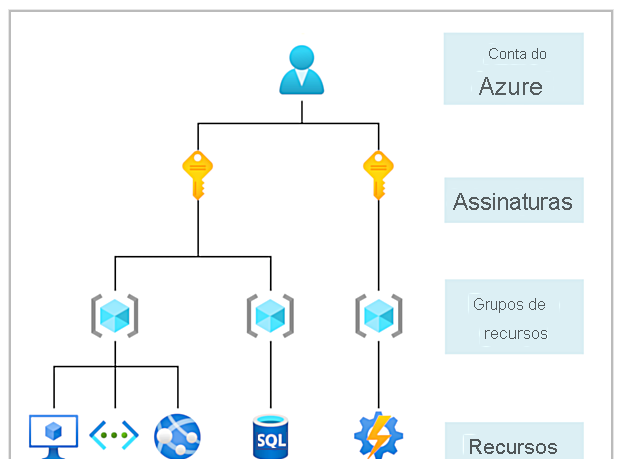
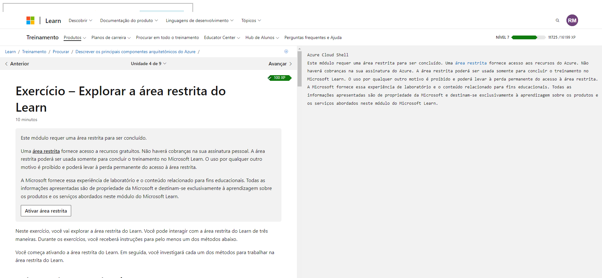
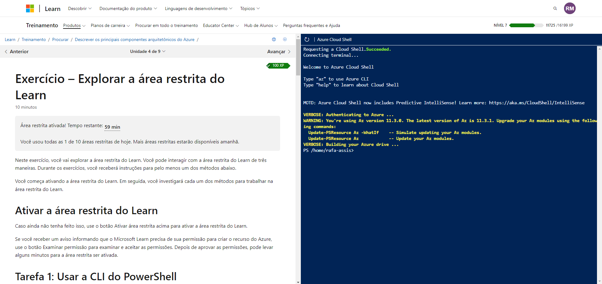
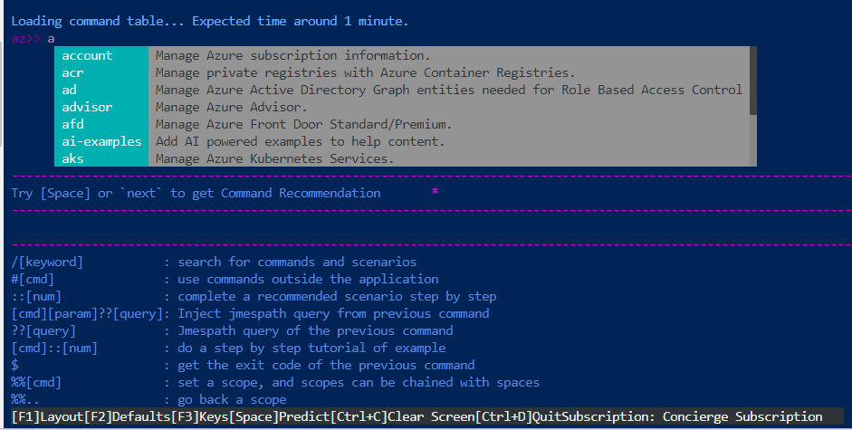
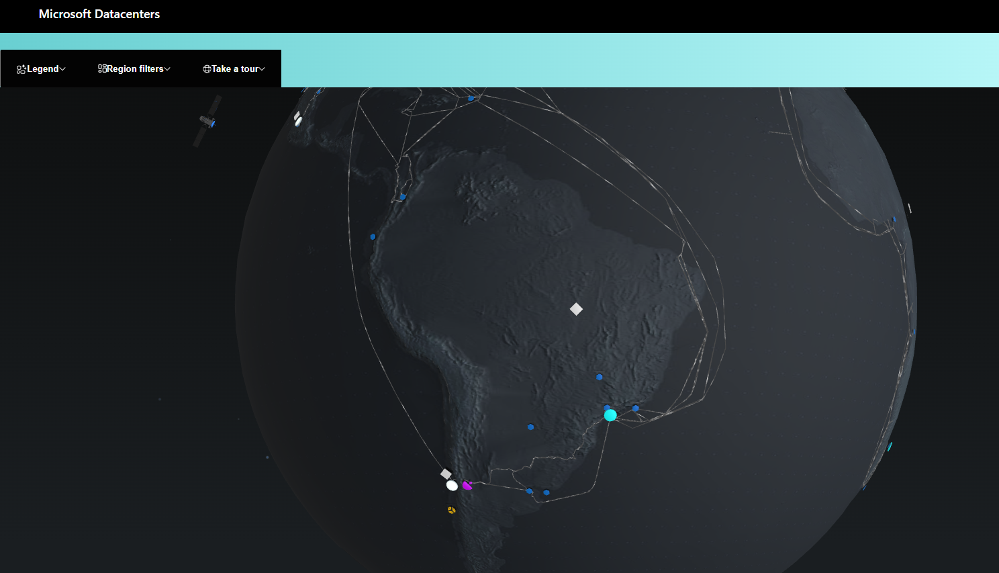

# Descrever os principais componentes arquitetônicos do Azure
48 min
Módulo
9 Unidades
Iniciante
Administrador
Desenvolvedor
Engenheiro de DevOps
Arquiteto de Soluções
Azure
Este módulo explica os componentes básicos de infraestrutura do Microsoft Azure. Você aprenderá sobre a infraestrutura física, como os recursos são gerenciados e terá a oportunidade de criar um recurso do Azure.

Objetivos de aprendizagem
Ao concluir este módulo, você será capaz de:

Descrever regiões do Azure, pares de regiões e regiões soberanas
Descrever Zonas de Disponibilidade
Descrever datacenters do Azure
Descrever recursos e grupos de recursos do Azure
Descrever assinaturas
Descrever grupos de gerenciamento
Descrever a hierarquia de grupos de recursos, assinaturas e grupos de gerenciamento
Pré-requisitos
Familiaridade básica com termos e conceitos de TI
Este módulo faz parte destes roteiros de aprendizagem
AZ-305: pré-requisitos do Microsoft Azure Architect Design
Conceitos básicos do Microsoft Azure: descrever a arquitetura e os serviços do Azure
Introdução
1 min
O que é o Microsoft Azure
4 min
Introdução a contas do Azure
4 min
Exercício – Explorar a área restrita do Learn
10 min
Descrever a infraestrutura física do Azure
6 min
Descrever a infraestrutura de gerenciamento do Azure
7 min
Exercício – Criar uma conta do Azure
10 min
Verificação de conhecimentos
4 min
Resumo
2 min

## Objetivos de aprendizagem

Depois de concluir este módulo, você poderá:

-   Descrever regiões do Azure, pares de regiões e regiões soberanas.
-   Descrever Zonas de Disponibilidade.
-   Descrever datacenters do Azure.
-   Descrever recursos e grupos de recursos do Azure.
-   Descrever assinaturas.
-   Descrever grupos de gerenciamento.
-   Descrever a hierarquia de grupos de recursos, assinaturas e grupos de gerenciamento.
-   
## O que é o Microsoft Azure

Se fala (éjur)

O Azure é um conjunto de serviços de nuvem dda microfost. Azure oferece a liberdade de criar, gerenciar e implantar aplicativos em uma enorme rede global usando suas ferramentas e estruturas favoritas.

O Azure fornece mais de 100 serviços que permitem que você faça de tudo – desde a execução de aplicativos existentes em máquinas virtuais até a exploração de novos paradigmas de software, como bots inteligentes e realidade misturada.

Muitas equipes começam a explorar a nuvem migrando os aplicativos para VMs (máquinas virtuais) que são executadas no Azure. Migrar os aplicativos existentes para VMs é um bom começo, mas a nuvem é muito mais do que apenas um local diferente para executar suas VMs.

Por exemplo, o Azure fornece serviços de IA (inteligência artificial) e de ML (machine learning) que se comunicam naturalmente com os usuários por meio de recursos visuais, auditivos e de fala. Ele também fornece soluções de armazenamento que são ampliadas dinamicamente para acomodar grandes volumes de dados. Os serviços do Azure habilitam soluções que não seriam possíveis sem os recursos da nuvem.

## Introdução a contas do Azure

Para criar e usar os serviços do Azure, você precisa de uma assinatura do Azure. 

### A conta gratuita da azure

A conta gratuita do Azure inclui:

-   Acesso gratuito a produtos populares do Azure por 12 meses.
-   Um crédito a ser usado nos primeiros 30 dias.
-   Acesso a mais de 25 produtos que são sempre gratuitos.

A  [conta gratuita do Azure](https://azure.microsoft.com/free)  é uma excelente maneira para novos usuários começarem e explorarem. Para se inscrever, você precisa de um número de telefone, um cartão de crédito e uma conta Microsoft ou do GitHub. As informações do cartão de crédito são usadas somente para verificação de identidade. Você não será cobrado por nenhum serviço até que atualize para uma assinatura paga.

### O que é a conta de estudante gratuita do Azure?

A oferta da conta de estudante gratuita do Azure inclui:

-   Acesso gratuito a determinados produtos do Azure por 12 meses.
-   Um crédito a ser usado nos primeiros 12 meses.
-   Acesso gratuito a determinadas ferramentas para desenvolvedores de software.

A  [conta de estudante gratuita do Azure](https://azure.microsoft.com/free/students/)  é uma oferta para estudantes que oferece US$ 100 de crédito e ferramentas para desenvolvedores gratuitas. Além disso, você pode se inscrever sem um cartão de crédito.

### O que é a área restrita do Microsoft Learn - Deesnvolver na azure como aprendizagem

Muitos dos exercícios do Microsoft Learn usam uma tecnologia chamada área restrita, que cria uma assinatura temporária que é adicionada à conta do Azure. Essa assinatura temporária permite que você crie recursos do Azure durante o módulo do Microsoft Learn. O Microsoft Learn limpa automaticamente os recursos temporários para você depois de concluir o módulo.

Ao concluir um módulo do Microsoft Learn, você poderá usar a assinatura pessoal para realizar os exercícios do módulo. Porém, a área restrita é o método de uso preferencial, pois permite criar e testar recursos do Azure sem gerar custos para você.

## Explorar MicrosoftLeanr

OBS: na seçâo seguinte já temos acesso a um `Azure Clodu Shell`, ou seja, a um ambiente de Azure temporarario (Microfost Learn) para testar os recuros da Azure.

Após isso tem que ativar e ai vai ficar asism: 

Além disos a o mudo azur interativo, ativao ao digitar `azure interactive`.

Nesse modo você nao precisa digitar `az` antes do comando,  eo sistema vem com muitas features como auto-complete para faciltiar o seu trabalho.

## Descrever a infraestrutura física do Azure

Concluído100 XP

-   6 minutos

Ao longo de seu percurso com o Microsoft Azure, você ouvirá e usará termos como **Regiões, Zonas de Disponibilidade, Recursos, Assinaturas** etc. 

Este módulo se concentra nos principais componentes de arquitetura do Azure. Os principais componentes da arquitetura do Azure podem ser divididos em dois agrupamentos principais: a infraestrutura física e a infraestrutura de gerenciamento.

### Infraestrutura física

A infraestrutura física do Azure começa com datacenters. Conceitualmente, os datacenters são iguais aos grandes datacenters corporativos. São instalações com recursos organizados em racks com energia, refrigeração e infraestrutura de rede dedicadas.

Como um provedor de nuvem global, o Azure tem datacenters em todo o mundo. No entanto, esses datacenters individuais não estão diretamente acessíveis. Os datacenters são agrupados em Regiões do Azure ou em Zonas de Disponibilidade do Azure projetadas para ajudá-lo a obter resiliência e confiabilidade para suas cargas de trabalho críticas para os negócios.

O site  [Infraestrutura global](https://infrastructuremap.microsoft.com/globe)  possibilita explorar interativamente a infraestrutura subjacente do Azure.

#### Regiões

Uma região é uma área geográfica do planeta que contém pelo menos um data center, mas possivelmente vários, nas proximidades e conectado a uma rede de baixa latência. O Azure atribui e controla os recursos de modo inteligente dentro de cada região para garantir que as cargas de trabalho sejam balanceadas corretamente.

Quando você implanta um recurso no Azure, geralmente precisa escolher a região em que deseja que ele seja implantado.

> Observação
Alguns serviços ou recursos de VM (máquina virtual) estão disponíveis somente em determinadas regiões, como tamanhos específicos de VMs ou tipos de armazenamento. Também há alguns serviços globais do Azure que não exigem que você selecione uma região específica, como o Azure Active Directory, o Gerenciador de Tráfego do Azure e o DNS do Azure.

### Zonas de Disponibilidade

Zonas de disponibilidade são datacenters separados fisicamente dentro de uma região do Azure. Cada zona de disponibilidade é composta de um ou mais datacenters equipados com energia, resfriamento e rede independentes. Uma zona de disponibilidade é configurada para ser um limite de isolamento. Se uma zona ficar inativa, as outras continuarão funcionando. Zonas de disponibilidade são conectadas por meio de redes de fibra óptica privadas de alta velocidade.

> Importante
Para garantir a resiliência, no mínimo três zonas de disponibilidade separadas estão presentes em todas as regiões habilitadas para zona de disponibilidade. No entanto, nem todas as Regiões do Azure atualmente dão suporte a zonas de disponibilidade.

#### Usar zonas de disponibilidade em seus aplicativos

É importante verificar se seus serviços e dados são redundantes para que você possa proteger suas informações em caso de falha. Ao hospedar sua infraestrutura, a configuração de sua redundância exigirá a criação de ambientes de hardware duplicados. O Azure pode ajudar a tornar seu aplicativo altamente disponível por meio das zonas de disponibilidade.

Você pode usar as zonas de disponibilidade para executar aplicativos críticos e incorporar alta disponibilidade à arquitetura do aplicativo, colocalizando seus recursos de computação, armazenamento, rede e dados em uma zona de disponibilidade e replicando em outras zonas de disponibilidade. Tenha em mente que pode haver um custo para duplicar seus serviços e transferir dados entre zonas de disponibilidade.

As zonas de disponibilidade são destinadas, principalmente, a VMs, discos gerenciados, balanceadores de carga e bancos de dados SQL. Os serviços do Azure que dão suporte às zonas de disponibilidade enquadram-se em três categorias:

-   Serviços em zonas: você fixa o recurso a uma zona específica (por exemplo, VMs, discos gerenciados, endereços IP).
-   Serviços com redundância de zona: a plataforma replica automaticamente entre zonas (por exemplo, armazenamento com redundância de zona, Banco de Dados SQL).
-   Serviços não regionais: os serviços estão sempre disponíveis em geografias do Azure e são resilientes a interrupções em toda a zona, bem como a interrupções em toda a região.

Mesmo com a resiliência adicional que as zonas de disponibilidade proporcionam, é possível que um evento possa ser tão grande que afete várias zonas de disponibilidade em uma só região. Para fornecer ainda mais resiliência, o Azure tem Pares de Regiões.

### Pares de regiões

A maioria das regiões do Azure é emparelhada a outra região na mesma geografia (como EUA, Europa ou Ásia) a pelo menos 300 milhas (cerca de 480 km) de distância. Essa abordagem permite a replicação de recursos em uma geografia, o que ajuda a reduzir a probabilidade de interrupções devido a eventos como desastres naturais, conflitos civis, quedas de energia ou interrupções de rede física afetarem toda uma região. Por exemplo, se uma região em um par de regiões fosse afetada por um desastre natural, os serviços fariam failover automaticamente para a outra região nesse par.

> Importante
Nem todos os serviços do Azure replicam dados automaticamente ou retornam automaticamente de uma região com falha para replicação cruzada para outra região habilitada. Nesses cenários, a recuperação e a replicação devem ser configuradas pelo cliente.

**Exemplos de pares de regiões** no Azure são Oeste dos EUA emparelhado com Leste dos EUA e Sudeste da Ásia emparelhado com Leste da Ásia. Como o par de regiões está diretamente conectado e suficientemente afastado para ser isolado contra desastres regionais, você pode usá-lo para fornecer redundância de dados e serviços confiáveis.

#### Vantagens adicionais dos pares de regiões:

-   Se ocorrer uma interrupção ampla do Azure, uma região de cada par será priorizada para que pelo menos uma seja restaurada quanto antes para os aplicativos hospedados nesse par de regiões.
-   As atualizações planejadas do Azure são distribuídas para regiões emparelhadas uma por vez, de modo a minimizar o tempo de inatividade e o risco de interrupção dos aplicativos.
-   Os dados continuam residindo na mesma geografia que seu par (com exceção do Sul do Brasil) para fins de jurisdição do imposto e aplicação da lei.

> Importante
A maioria das regiões é emparelhada em duas direções, o que significa que elas são o backup para a região que fornece um backup para elas (Oeste dos EUA e Leste dos EUA fazem backup entre si). No entanto, algumas regiões, como Índia Ocidental e Sul do Brasil, são emparelhadas em apenas uma direção. Em um emparelhamento de uma direção, a região primária não fornece backup para a região secundária. Assim, mesmo que a região secundária da Índia Ocidental seja o Sul da Índia, o Sul da Índia não depende da Índia Ocidental. A região secundária do Oeste da Índia é o Sul da Índia, mas a região secundária do Sul da Índia é a Índia Central. O Sul do Brasil é exclusivo porque ele está associado a uma região fora de sua região geográfica. A região secundária do Sul do Brasil é o Centro-Sul dos EUA. A região secundária do Centro-Sul dos EUA não é Sul do Brasil.

### Regiões soberanas

Além das regiões normais, o Azure também tem regiões soberanas. Regiões soberanas são instâncias do Azure isoladas da instância principal do Azure. Talvez seja necessário usar uma região soberana para fins legais ou de conformidade.

As regiões soberanas do Azure incluem:

-   US DoD Central, US Gov – Virgínia, US Gov Iowa, entre outros: essas regiões são instâncias lógicas e físicas do Azure isoladas da rede, destinadas a parceiros e órgãos do governo dos EUA. Esses datacenters são operados por cidadãos selecionados dos EUA e incluem certificações de conformidade adicionais.
-   Leste da China, Norte da China, entre outros: essas regiões estão disponíveis por meio de uma parceria exclusiva entre a Microsoft e a 21Vianet, segundo a qual a Microsoft não mantém diretamente os data centers.
-   

## Descrever a infraestrutura de gerenciamento do Azure

A infraestrutura de gerenciamento inclui recursos do Azure e grupos de recursos, assinaturas e contas. Entender a organização hierárquica ajudará você a planejar seus projetos e produtos no Azure.

## Recursos (*resources*) e grupos de recursos (*resources group*) do Azure

=> resources

Um recurso é o bloco de construção básico do Azure. 

Qualquer coisa que você criar, provisionar, implantar etc: é um recurso. VMs (máquinas virtuais), redes virtuais, bancos de dados, serviços cognitivos etc. são todos considerados recursos no Azure.

=> resource groups

Os grupos de recursos são simplesmente agrupamentos de recursos. Quando você cria um recurso, é necessário colocá-lo em um grupo de recursos. Embora um grupo de recursos possa conter muitos recursos, apenas um recurso pode estar em um grupo de recursos por vez. Alguns recursos podem ser movidos entre grupos de recursos, mas quando você move um recurso para um novo grupo, ele não é mais associado ao grupo anterior. Além disso, os grupos de recursos não podem ser aninhados, o que significa que você não pode colocar o grupo de recursos B dentro do grupo de recursos A.

Os grupos de recursos oferecem um modo conveniente de agrupar recursos. **Quando você aplicar uma ação a um grupo de recursos, essa ação será aplicada a todos os recursos dentro do grupo de recursos**. Se você excluir um grupo de recursos, todos os recursos serão excluídos. Se você conceder ou negar acesso a um grupo de recursos, vai conceder ou negar acesso a todos os recursos dentro do grupo de recursos.

Quando você está provisionando recursos, pense na estrutura do grupo de recursos que melhor atende às suas necessidades.

**EXEMPLO:** se você estiver configurando um ambiente de desenvolvimento temporário, agrupar todos os recursos significa que você pode desprovisionar todos os recursos associados de uma só vez excluindo o grupo de recursos. Se você estiver provisionando recursos de computação que precisarão de três esquemas de acesso diferentes, talvez seja melhor agrupar recursos com base no esquema de acesso e depois atribuir acesso no nível do grupo de recursos.

Não há regras rígidas sobre como você usa grupos de recursos, portanto, considere como configurar seus grupos de recursos para maximizar a utilidade deles para você.

## Assinaturas do Azure

No Azure, as assinaturas são uma unidade de gerenciamento, cobrança e escala. Semelhante a como os grupos de recursos são um modo de organizar logicamente os recursos, as assinaturas permitem organizar logicamente seus grupos de recursos e facilitar a cobrança.

A utilização do Azure exige uma Assinatura do Azure. Uma assinatura fornece a você acesso autenticado e autorizado a serviços e produtos do Azure. Ela também permite que você provisione recursos. Uma assinatura do Azure é vinculada a uma conta do Azure, que é uma identidade no Microsoft Entra ID ou em um diretório no qual o Microsoft Entra ID confia.

Uma conta pode ter várias assinaturas, mas só é necessário ter uma. Em uma conta com várias assinaturas, você pode usar as assinaturas para configurar diferentes modelos de cobrança e aplicar diferentes políticas de gerenciamento de acesso. Você pode usar as assinaturas do Azure para definir limites em relação a produtos, serviços e recursos do Azure. Você pode usar dois tipos de limites de assinatura:

-   **Limite de cobrança**: Esse tipo de assinatura determina como uma conta do Azure é cobrada pelo uso do Azure. Você pode criar várias assinaturas para atender a diferentes tipos de requisitos de cobrança. O Azure gera relatórios de cobrança e faturas separados para cada assinatura, para que você possa organizar e gerenciar os custos.
-   **Limite de controle de acesso**: O Azure aplica políticas de gerenciamento de acesso no nível da assinatura, e você pode criar assinaturas separadas para refletir diferentes estruturas organizacionais. Um exemplo disso é que, em um negócio, você tem diferentes departamentos aos quais aplica políticas de assinatura do Azure distintas. Esse modelo de cobrança permite gerenciar e controlar o acesso aos recursos que os usuários provisionam com assinaturas específicas.

### Criar assinaturas adicionais do Azure

Semelhante ao uso de grupos de recursos para separar recursos por função ou acesso, talvez você queira criar assinaturas adicionais para gerenciamento de recursos ou cobrança. Por exemplo, é possível criar assinaturas adicionais para separar:

-   **Ambientes**: você pode optar por criar assinaturas adicionais a fim de configurar ambientes separados para desenvolvimento e teste, segurança ou para isolar dados por motivos de conformidade. Esse design é particularmente útil porque o controle de acesso ao recurso ocorre no nível da assinatura.
-   **Estruturas organizacionais**: É possível criar assinaturas para refletir diferentes estruturas organizacionais. Você poderia, por exemplo, limitar uma equipe a recursos de baixo custo, enquanto permite uma gama completa para o departamento de TI. Esse design permite gerenciar e controlar o acesso aos recursos que os usuários provisionam em cada assinatura.
-   **Cobrança**: você pode criar assinaturas adicionais para fins de cobrança. Como os custos são agregados primeiro no nível da assinatura, talvez você queira criar assinaturas para gerenciar e controlar os custos com base em suas necessidades. Por exemplo, talvez você queira criar uma assinatura para as cargas de trabalho de produção e outra para as cargas de trabalho de desenvolvimento e teste.

## Grupos de gerenciamento do Azure (container de assinaturas)

A última parte é o grupo de gerenciamento. Os recursos são reunidos em grupos de recursos e os grupos de recursos são reunidos em assinaturas. Se você está começando a usar o Azure, isso pode parecer hierarquia suficiente para manter as coisas organizadas. Porém, imagine que você está lidando com vários aplicativos e várias equipes de desenvolvimento em várias regiões geográficas.

Se você tiver muitas assinaturas, talvez precise de um modo de gerenciar o acesso, as políticas e a conformidade com eficiência para essas assinaturas. Os grupos de gerenciamento do Azure fornecem um nível de escopo acima das assinaturas. Você organiza as assinaturas em contêineres chamados grupos de gerenciamento e aplica as condições de governança a esses grupos. Todas as assinaturas em um grupo de gerenciamento herdam automaticamente as condições aplicadas ao grupo de gerenciamento, da mesma forma que os grupos de recursos herdam configurações de assinaturas e recursos herdados de grupos de recursos. Os grupos de gerenciamento fornecem gerenciamento corporativo em larga escala, independentemente do tipo de assinaturas que você possa ter. Grupos de gerenciamento podem ser aninhados.

## Grupo de gerenciamento, assinaturas e hierarquia de grupo de recursos

É possível compilar uma estrutura flexível de grupos de gerenciamento e assinaturas para organizar seus recursos em uma hierarquia para políticas unificadas e gerenciamento de acesso. O diagrama a seguir mostra um exemplo de criação de uma hierarquia de governança usando grupos de gerenciamento.

Alguns exemplos de como você pode usar grupos de gerenciamento podem ser:

-   **Criar uma hierarquia que aplica uma política**. Você pode limitar os locais de VM à região Oeste dos EUA em um grupo chamado Produção. Essa política herdará todas as assinaturas nesse grupo de gerenciamento e será aplicada a todas as VMs sob essas assinaturas. Essa política de segurança não pode ser alterada pelo proprietário da assinatura nem do recurso, o que permite uma governança aprimorada.
-   **Fornecer acesso do usuário a várias assinaturas**. Ao mover várias assinaturas em um grupo de gerenciamento, você poderá criar uma atribuição de RBAC do Azure (controle de acesso baseado em função do Azure) no grupo de gerenciamento. Atribuir o RBAC do Azure no nível do grupo de gerenciamento significa que todos os grupos de subgerenciamento, assinaturas, grupos de recursos e recursos abaixo desse grupo de gerenciamento também herdam essas permissões. Uma atribuição no grupo de gerenciamento pode permitir que os usuários tenham acesso a tudo que for necessário, em vez de criar scripts do Azure RBAC em assinaturas diferentes.

Fatos importantes sobre os grupos de gerenciamento:

-   10.000 grupos de gerenciamento podem ter suporte em um único diretório.
-   Uma árvore do grupo de gerenciamento pode dar suporte a até seis níveis de profundidade. Esse limite não inclui o nível raiz nem o nível da assinatura.
-   Cada grupo de gerenciamento e assinatura podem dar suporte a somente um pai.
-   
## Exercicio - Criar uma VM usado comandos

## Tarefa 2: verificar os recursos criados

Depois que a implantação for criada, você poderá verificar se o Azure criou não apenas uma VM, mas todos os recursos associados de que a VM precisa.

1.  Selecionar a Página inicial
2.  Selecionar Grupos de recursos

Selecionar o grupo de recursos  learn-6586a66a-9d5e-46b2-80a2-132b5f927cf1

Você deve ver uma lista de recursos no grupo de recursos. A conta de armazenamento e a rede virtual estão associadas à área restrita do Learn. No entanto, o restante dos recursos foi criado quando você criou a máquina virtual. Por padrão, o Azure deu a todos eles um nome semelhante para ajudar na associação e os agrupou no mesmo grupo de recursos.

Parabéns! Você criou um recurso no Azure e teve a oportunidade de ver como os recursos são agrupados na criação.

## Limpar

A área restrita limpará automaticamente seus recursos quando você concluir este módulo.

Quando já estiver trabalhando na sua assinatura, analise se você ainda precisa dos recursos criados no fim de um projeto. Os recursos que você deixa em execução podem lhe custar dinheiro. Você pode excluir os recursos individualmente ou excluir o grupo de recursos para excluir todo o conjunto de recursos.

# perguntas

Verificar seus conhecimentos

1. Em quantos grupos de recursos um recurso pode estar ao mesmo tempo? 

Um
Um recurso só pode estar em um grupo por vez.

Dois

Três
2. O que acontece com os recursos dentro de um grupo de recursos quando uma ação ou configuração no nível do Grupo de Recursos é aplicada? 

Os recursos atuais herdam a configuração, mas os recursos futuros não.
As permissões do grupo de recursos são herdadas por todos os recursos no grupo de recursos, atual e futuro.

Os recursos futuros herdam a configuração, mas os atuais não.

A configuração é aplicada a recursos atuais e futuros.
Os recursos herdam permissões de seu grupo de recursos.

3. Qual recurso do Azure replica recursos entre regiões que estão a pelo menos 480 km umas das outras? 

Pares de regiões
A maioria das regiões do Azure é emparelhada a outra região na mesma geografia (como EUA, Europa ou Ásia) a pelo menos 480 km de distância.

Zonas de Disponibilidade

Regiões soberanas