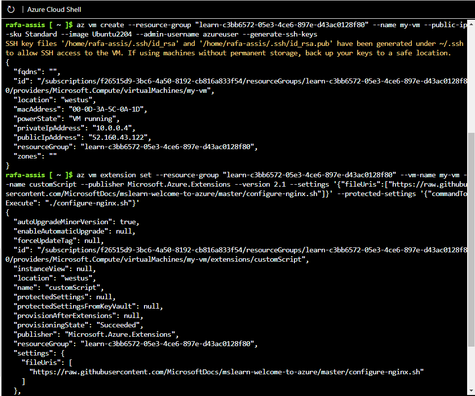
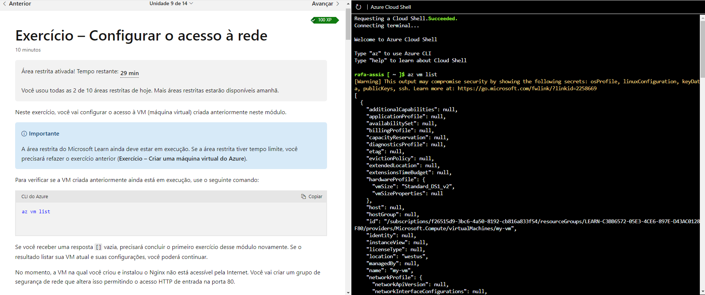
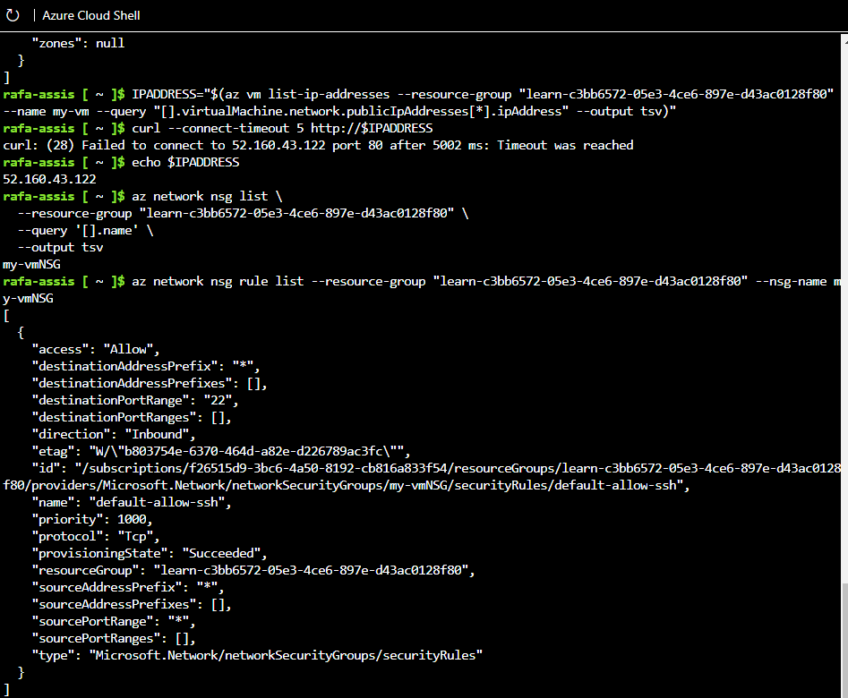
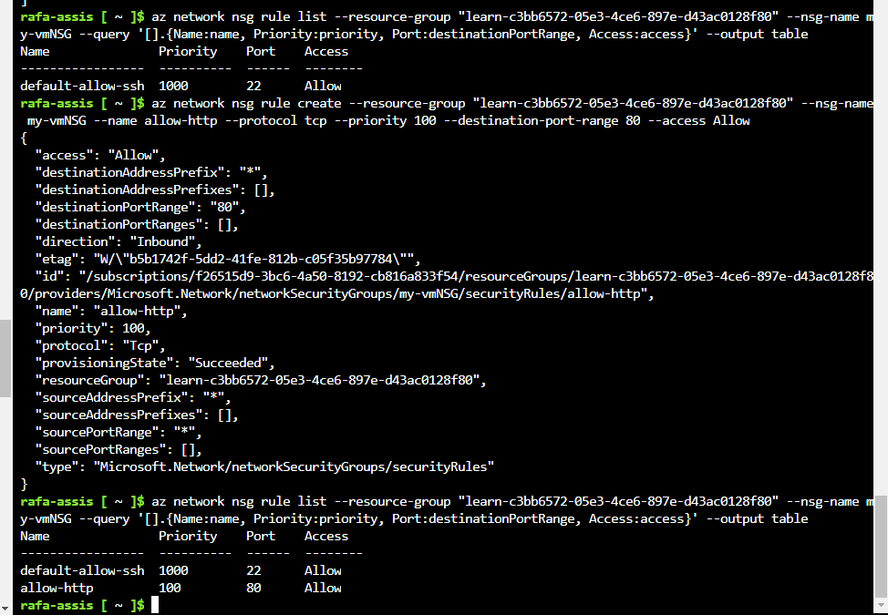
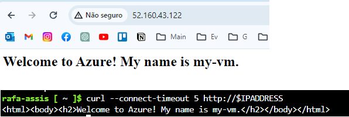

# Descrever os serviços de computação e rede do Azure

-   1 h 8 min
-   Módulo
-   14 Unidades

Comentários

Iniciante

Administrador

Desenvolvedor

Engenheiro de DevOps

Arquiteto de Soluções

Azure

Este módulo se concentra em alguns dos serviços de computador e serviços de rede disponíveis no Azure.

## Objetivos de aprendizagem

Ao concluir este módulo, você poderá:

-   Comparar tipos de computação, incluindo instâncias de contêiner, máquinas virtuais e funções
-   Descrever opções de VM (máquina virtual), incluindo VMs, Conjuntos de Dimensionamento de Máquinas Virtuais, conjuntos de disponibilidade, Área de Trabalho Virtual do Azure
-   Descrever os recursos necessários para máquinas virtuais
-   Descrever opções de hospedagem de aplicativos, incluindo Aplicativos Web do Azure, contêineres e máquinas virtuais
-   Descrever a rede virtual, incluindo a finalidade das Redes Virtuais do Azure, sub-redes virtuais do Azure, emparelhamento, DNS do Azure, Gateway de VPN e ExpressRoute
-   Definir pontos de extremidade públicos e privados

[Iniciar](https://learn.microsoft.com/pt-br/training/modules/describe-azure-compute-networking-services/1-introduction/)Adicionar

## Pré-requisitos

-   Familiaridade básica com termos e conceitos de TI

## Este módulo faz parte destes roteiros de aprendizagem

-   [AZ-305: pré-requisitos do Microsoft Azure Architect Design](https://learn.microsoft.com/training/paths/microsoft-azure-architect-design-prerequisites/)
-   [Conceitos básicos do Microsoft Azure: descrever a arquitetura e os serviços do Azure](https://learn.microsoft.com/training/paths/azure-fundamentals-describe-azure-architecture-services/)
-   


# Introdução

Concluído100 XP

-   1 minuto

Neste módulo, você será apresentado aos serviços de computação e rede do Azure. Você aprenderá sobre três das opções de computação (máquinas virtuais, contêineres e funções do Azure). Você também aprenderá sobre alguns dos recursos de rede, como redes virtuais do Azure, DNS do Azure e Azure ExpressRoute.

## Objetivos de aprendizagem

Depois de concluir este módulo, você poderá:

-   Comparar tipos de computação, incluindo instâncias de contêiner, máquinas virtuais e funções.
-   Descrever opções de máquina virtual, incluindo VMs (máquinas virtuais), conjuntos de dimensionamento de máquinas virtuais, conjuntos de disponibilidade de máquinas virtuais e Área de Trabalho Virtual do Azure.
-   Descrever os recursos necessários para máquinas virtuais.
-   Descrever as opções de hospedagem de aplicativos, incluindo Aplicativos Web, contêineres e máquinas virtuais do Azure.
-   Descrever a rede virtual, incluindo a finalidade das Redes Virtuais do Azure, sub-redes virtuais do Azure, emparelhamento, DNS do Azure, Gateway de VPN e ExpressRoute.
-   Definir pontos de extremidade públicos e privados.
-   

# VM


Com as VMs (Máquinas Virtuais) do Azure, você pode criar e usar VMs na nuvem. As VMs fornecem IaaS (infraestrutura como serviço) na forma de um servidor virtualizado e podem ser usadas ​​de várias maneiras. Como em um computador físico, você pode personalizar todos os programas de software em execução na VM. As VMs são uma opção ideal quando você precisa de:

-   Controle total sobre o SO (sistema operacional).
-   Capacidade para executar um software personalizado.
-   Usar configurações personalizadas de hospedagem.

Uma VM do Azure oferece a flexibilidade da virtualização sem a necessidade de comprar e manter o hardware físico que a executa. No entanto, como uma oferta de IaaS, você ainda precisa configurar, atualizar e manter o software executado na VM.

Você pode até mesmo criar ou usar uma imagem já criada para provisionar rapidamente VMs. Você pode criar e provisionar uma VM em minutos quando seleciona uma imagem de VM pré-configurada. Uma imagem é um modelo usado para criar uma VM e pode já incluir um sistema operacional e outros softwares, como ferramentas de desenvolvimento ou ambientes de hospedagem na Web.

## Dimensionar VMs no Azure

Você pode executar VMs únicas para teste, desenvolvimento ou para tarefas secundárias. Ou pode agrupar VMs para fornecer alta disponibilidade, escalabilidade e redundância. O Azure também pode gerenciar o agrupamento de VMs para você com recursos como conjuntos de dimensionamento e conjuntos de disponibilidade.

## Exemplos de quando usar VMs

Alguns exemplos comuns ou casos de uso para máquinas virtuais incluem:

-   **Durante o teste e o desenvolvimento**. As VMs fornecem uma maneira rápida e fácil de criar diferentes configurações de sistema operacional e de aplicativo. A equipe de teste e desenvolvimento pode excluir facilmente as VMs quando não precisarem mais delas.
-   **Ao executar aplicativos na nuvem**. A capacidade de executar determinados aplicativos na nuvem pública, em vez de criar uma infraestrutura tradicional para executá-los, pode trazer benefícios econômicos substanciais. Por exemplo, um aplicativo pode precisar lidar com flutuações na demanda. Desligar VMs quando elas não são necessárias ou iniciá-las rapidamente para atender a um aumento repentino na demanda significa que você paga apenas pelos recursos que usa.
-   **Ao estender seu datacenter para a nuvem**: uma organização pode estender os recursos de sua própria rede local criando uma rede virtual no Azure e adicionando VMs a ela. Aplicativos como o SharePoint podem, então, ser executados em uma VM do Azure em vez de localmente. É mais fácil ou menos caro implantar dessa forma do que em um ambiente local.
-   **Durante a recuperação de desastre**: assim como acontece com a execução de determinados tipos de aplicativos na nuvem e com a extensão de uma rede local para a nuvem, você pode conseguir economias significativas usando uma abordagem baseada em IaaS para a recuperação de desastre. Se um datacenter primário falhar, você poderá criar VMs em execução no Azure para executar seus aplicativos críticos e desligá-los quando o datacenter primário ficar operacional novamente.

## Migrar para a nuvem com VMs

As VMs também são uma excelente opção quando você migra de um servidor físico para a nuvem (também conhecido como lift-and-shift). Você pode criar uma imagem do servidor físico e hospedá-la em uma VM com poucas ou nenhuma alteração. Assim como um servidor local físico, você deve manter a VM: você é responsável por manter o sistema operacional e o software instalados.

## Recursos da VM

Ao provisionar uma VM, você também terá a oportunidade de escolher os recursos associados a essa VM, incluindo:

-   Tamanho (finalidade, número de núcleos de processador e quantidade de RAM)
-   Discos de armazenamento (unidades de disco rígido, unidades de estado sólido etc.)
-   Rede (rede virtual, endereço IP público e configuração de porta)


## Exercicio: Criar VM e instalar nginx




## Tarefa 1: criar uma máquina virtual do Linux e instalar o Nginx

Use os comandos da CLI do Azure a seguir para criar uma VM do Linux e instalar o Nginx. Depois que a VM for criada, você usará a Extensão de Script Personalizada para instalar o Nginx. A Extensão de Script Personalizado é uma maneira fácil de baixar e executar scripts em suas VMs do Azure. Ela é apenas uma das muitas maneiras de configurar o sistema depois que a VM está em funcionamento.

1.  No Cloud Shell, execute o comando  `az vm create`  a seguir para criar uma VM do Linux:
    
    CLI do AzureCopiar
    
    ```
    az vm create \
      --resource-group "learn-c3bb6572-05e3-4ce6-897e-d43ac0128f80" \
      --name my-vm \
      --public-ip-sku Standard \
      --image Ubuntu2204 \
      --admin-username azureuser \
      --generate-ssh-keys    
    
    ```
    
    Sua VM levará alguns minutos para ser exibida. Você nomeou a VM como  **my-vm**. Use esse nome para se referir à VM em etapas posteriores.
    
2.  Execute este comando  `az vm extension set`  para configurar o Nginx em sua VM:
    
    CLI do AzureCopiar
    
    ```
    az vm extension set \
      --resource-group "learn-c3bb6572-05e3-4ce6-897e-d43ac0128f80" \
      --vm-name my-vm \
      --name customScript \
      --publisher Microsoft.Azure.Extensions \
      --version 2.1 \
      --settings '{"fileUris":["https://raw.githubusercontent.com/MicrosoftDocs/mslearn-welcome-to-azure/master/configure-nginx.sh"]}' \
      --protected-settings '{"commandToExecute": "./configure-nginx.sh"}'    
    
    ```
    
    Esse comando usa a Extensão de Script Personalizado para executar um script do Bash em sua VM. O script é armazenado no GitHub. Enquanto o comando é executado, você pode  [examinar o script do Bash](https://raw.githubusercontent.com/MicrosoftDocs/mslearn-welcome-to-azure/master/configure-nginx.sh)  em uma guia separada no navegador. Para resumir, o script:
    
    1.  Executa  `apt-get update`  para baixar as informações mais recentes do pacote da Internet. Esta etapa ajuda a garantir que o próximo comando possa localizar a versão mais recente do pacote Nginx.
    2.  Instala o Nginx.
    3.  Define a home page,  _/var/www/html/index.html_, para imprimir uma mensagem de boas-vindas que inclui o nome de host da VM.


## Azure Virtual Desktop

Outro tipo de máquina virtual é a Área de Trabalho Virtual do Azure. A Área de Trabalho Virtual do Azure é um serviço de virtualização de área de trabalho e aplicativos que é executado na nuvem. Ele permite que você use uma versão do Windows hospedada na nuvem em qualquer localização. A Área de Trabalho Virtual do Azure opera em dispositivos e sistemas operacionais e funciona com aplicativos que você pode usar para acessar áreas de trabalho remotas ou a maioria dos navegadores modernos.

É praticamente ter um windows 10 rodando numa maquina fora e voce acessa via streming.


# Descrever contêineres (docker) do Azure

Concluído100 XP

-   6 minutos

Embora as máquinas virtuais sejam uma excelente maneira de reduzir os custos em comparação com os investimentos necessários para o hardware físico, elas ainda estão limitadas a um sistema operacional por máquina virtual. Se você quer executar várias instâncias de um aplicativo em um só computador host, os contêineres são uma ótima opção.

## O que são contêineres?

Contêineres são um ambiente de virtualização. Assim como a execução de várias máquinas virtuais em um só host físico, você pode executar vários contêineres em apenas um host físico ou virtual. Diferentemente das máquinas virtuais, você não gerencia o sistema operacional para um contêiner. Máquinas virtuais parecem ser uma instância de um sistema operacional que você pode gerenciar e ao qual pode se conectar. Os contêineres são leves e projetados para serem criados, dimensionados e interrompidos dinamicamente. É possível criar e implantar máquinas virtuais à medida que a demanda do aplicativo aumenta, mas os contêineres são um método mais leve e ágil. Os contêineres foram projetados para permitir que você responda às alterações sob demanda. Com contêineres, você pode reiniciar rapidamente se houver uma falha ou de uma interrupção de hardware. Um dos mecanismos de contêiner mais populares é o Docker, e o Azure é compatível com o Docker.

## Comparar máquinas virtuais e contêineres

O seguinte vídeo destaca várias diferenças importantes entre máquinas virtuais e contêineres:

### Instâncias de Contêiner do Azure

As Instâncias de Contêiner do Azure oferecem a maneira mais rápida e simples de executar um contêiner no Azure, sem a necessidade de gerenciar máquinas virtuais nem adotar serviços adicionais. Instâncias de Contêiner do Azure são uma oferta de PaaS (plataforma como serviço). Instâncias de Contêiner do Azure permitem que você carregue seus contêineres e então o serviço executa os contêineres para você.

### Aplicativos de Contêiner do Azure

Os Aplicativos de Contêiner do Azure são semelhantes, em muitos aspectos, a uma instância de contêiner. Eles permitem que você comece a trabalhar imediatamente, removem a parte de gerenciamento de contêineres e são uma oferta de PaaS. Os Aplicativos de Contêiner têm benefícios extras, como a capacidade de incorporar balanceamento de carga e colocação em escala. Essas outras funções permitem que você seja mais flexível em seu design.

### Serviço de Kubernetes do Azure

O Serviço de Kubernetes do Azure (AKS) é um serviço de orquestração de contêiner. Um serviço de orquestração gerencia o ciclo de vida dos contêineres. Quando você está implantando uma frota de contêineres, o AKS pode tornar o gerenciamento de frota mais simples e eficiente.

### Usar contêineres em suas soluções

Contêineres geralmente são usados para criar soluções que utilizam uma arquitetura de microsserviço. Essa arquitetura é onde você divide as soluções em partes menores e independentes. Por exemplo, você pode dividir um site em um contêiner que hospeda o front-end, outro que hospeda o back-end e um terceiro para o armazenamento. Essa divisão permite separar as partes do aplicativo em seções lógicas que podem ser mantidas, dimensionadas ou atualizadas de forma independente.

Imagine que o back-end do site atingiu a capacidade, mas o front-end e o armazenamento não estão sob pressão. Com contêineres, você pode dimensionar o back-end separadamente para melhorar o desempenho. Se algo exigisse tal alteração, você também poderia optar por alterar o serviço de armazenamento ou modificar o front-end sem afetar nenhum dos outros componentes.


# Descrever Azure Functions do Azure - serveless computing

Resumo: Voce so se precupa no que fazer, nao se preocupa com o servidor que vai fazer isso. É mais fácl de esclar, ainda mais se for algo pequneo. Voce paga pelo tempo que o evento gastou na maquina

Concluído100 XP

-   4 minutos

O Azure Functions é uma opção de computação sem servidor controlada por eventos que não requer a manutenção de máquinas virtuais ou contêineres. Se você criar um aplicativo usando VMs ou contêineres, esses recursos precisarão estar "em execução" para que seu aplicativo funcione. Com o Azure Functions, um evento desperta a função, reduzindo a necessidade de manter os recursos provisionados quando não há eventos.

## Computação sem servidor no Azure

## Benefícios do Azure Functions

Usar o Azure Functions é ideal quando você está preocupado apenas com o código que executa o serviço, e não com a plataforma ou a infraestrutura subjacente. As funções costumam ser usadas quando você precisa executar um trabalho em resposta a um evento (geralmente por meio de uma solicitação REST), um temporizador ou uma mensagem de outro serviço do Azure e quando esse trabalho pode ser concluído dentro de segundos.

As funções são dimensionadas automaticamente com base na demanda, portanto, podem ser uma boa opção quando a demanda é variável.

O Azure Functions executa o código quando este é disparado e desaloca os recursos automaticamente quando a função é concluída. Neste modelo, você só é cobrado pelo tempo de CPU usado durante a execução da função.

As funções podem ser sem estado ou com estado. Quando são sem estado (o padrão), elas se comportam como se fossem reiniciadas sempre que respondem a um evento. Quando são com estado (chamadas de Durable Functions), um contexto é passado pela função para acompanhar a atividade anterior.

As funções são um componente chave da computação sem servidor. Elas também são uma plataforma de computação geral para executar qualquer tipo de código. Se as necessidades do aplicativo do desenvolvedor forem alteradas, você poderá implantar o projeto em um ambiente que não seja sem servidor. Essa flexibilidade permite gerenciar o dimensionamento, executar em redes virtuais e até mesmo isolar completamente as funções.# Descrever funções do Azure

Concluído100 XP

-   4 minutos

O Azure Functions é uma opção de computação sem servidor controlada por eventos que não requer a manutenção de máquinas virtuais ou contêineres. Se você criar um aplicativo usando VMs ou contêineres, esses recursos precisarão estar "em execução" para que seu aplicativo funcione. Com o Azure Functions, um evento desperta a função, reduzindo a necessidade de manter os recursos provisionados quando não há eventos.

## Computação sem servidor no Azure

## Benefícios do Azure Functions

Usar o Azure Functions é ideal quando você está preocupado apenas com o código que executa o serviço, e não com a plataforma ou a infraestrutura subjacente. As funções costumam ser usadas quando você precisa executar um trabalho em resposta a um evento (geralmente por meio de uma solicitação REST), um temporizador ou uma mensagem de outro serviço do Azure e quando esse trabalho pode ser concluído dentro de segundos.

As funções são dimensionadas automaticamente com base na demanda, portanto, podem ser uma boa opção quando a demanda é variável.

O Azure Functions executa o código quando este é disparado e desaloca os recursos automaticamente quando a função é concluída. Neste modelo, você só é cobrado pelo tempo de CPU usado durante a execução da função.

As funções podem ser sem estado ou com estado. Quando são sem estado (o padrão), elas se comportam como se fossem reiniciadas sempre que respondem a um evento. Quando são com estado (chamadas de Durable Functions), um contexto é passado pela função para acompanhar a atividade anterior.

As funções são um componente chave da computação sem servidor. Elas também são uma plataforma de computação geral para executar qualquer tipo de código. Se as necessidades do aplicativo do desenvolvedor forem alteradas, você poderá implantar o projeto em um ambiente que não seja sem servidor. Essa flexibilidade permite gerenciar o dimensionamento, executar em redes virtuais e até mesmo isolar completamente as funções.


# Descrever as opções de hospedagem de aplicativo

Concluído100 XP

-   3 minutos

Se você precisar hospedar seu aplicativo no Azure, poderá inicialmente recorrer a uma VM (máquina virtual) ou contêineres. Tanto VMs quanto contêineres fornecem excelentes soluções de hospedagem. As VMs oferecem o controle máximo do ambiente de hospedagem e permitem que você o configure exatamente como deseja. As VMs também poderão ser o método de hospedagem mais familiar se você for novo na nuvem. Os contêineres, com a capacidade de isolar e gerenciar individualmente diferentes aspectos da solução de hospedagem, também podem ser uma opção robusta e atraente.

Há outras opções de hospedagem que você pode usar com o Azure, incluindo Serviço de Aplicativo do Azure.

## Serviço de aplicativo do Azure

O Serviço de Aplicativo permite que você crie e hospede aplicativos Web, trabalhos em segundo plano, back-ends de dispositivos móveis e APIs RESTful na linguagem de programação de sua escolha sem gerenciar a infraestrutura. Ele oferece dimensionamento automático e alta disponibilidade. O Serviço de Aplicativo é compatível com o Windows e o Linux. Ele permite implantações automatizadas do GitHub, Azure DevOps ou qualquer repositório Git para dar suporte a um modelo de implantação contínua.

O Serviço de Aplicativo do Azure é uma opção de hospedagem robusta que você pode usar para hospedar seus aplicativos no Azure. O Serviço de Aplicativo do Azure permite que você se concentre em criar e manter seu aplicativo, e o Azure se concentra em manter o ambiente em funcionamento.

O Serviço de Aplicativo do Azure é um serviço com base em HTTP para hospedagem de aplicativos Web, APIs REST e back-ends móveis. Ele dá suporte a várias linguagens, incluindo .NET, .NET Core, Java, Ruby, Node.js, PHP ou Python. Ele também dá suporte a ambientes Windows e Linux.

### Tipos de serviços de aplicativos

Com o Serviço de Aplicativo, você pode hospedar os estilos mais comuns de serviço de aplicativos, como:

-   Aplicativos Web
-   Aplicativos de API
-   WebJobs
-   Aplicativos móveis

O Serviço de Aplicativo cuida da maioria das decisões de infraestrutura com as quais você lida ao hospedar aplicativos acessíveis pela Web:

-   A implantação e o gerenciamento são integrados à plataforma.
-   Pontos de extremidade podem ser protegidos.
-   Sites podem ser dimensionados rapidamente para lidar com cargas de alto tráfego.
-   O balanceamento de carga interno e o gerenciador de tráfego fornecem alta disponibilidade.

Todos esses estilos de aplicativos são hospedados na mesma infraestrutura e compartilham esses benefícios. Essa flexibilidade torna o Serviço de Aplicativo a escolha ideal para hospedar aplicativos voltados para a Web.

### Aplicativos Web

O Serviço de Aplicativo inclui suporte completo para a hospedagem de aplicativos Web usando ASP.NET, ASP.NET Core, Java, Ruby, Node.js, PHP ou Python. Você pode escolher Windows ou Linux como sistema operacional do host.

### Aplicativos de API

Da mesma forma como se hospeda um site, você pode criar APIs Web baseadas em REST usando a linguagem e a estrutura que você quiser. Receba o suporte completo do Swagger e a capacidade de empacotar e publicar sua API no Azure Marketplace. Os aplicativos produzidos podem ser consumidos por qualquer cliente baseado em HTTP ou em HTTPS.

### WebJobs

Você pode usar o recurso do WebJobs para executar um script (.cmd, .bat, PowerShell ou Bash) ou um programa (.exe, Java, PHP, Python ou Node.js) no mesmo contexto de um aplicativo Web, aplicativo de API ou aplicativo móvel. Eles também podem ser agendados ou executados por um gatilho. O WebJobs geralmente é usado para executar tarefas em segundo plano como parte da lógica do aplicativo.

### Aplicativos móveis

Use o recurso Aplicativos Móveis do Serviço de Aplicativo para criar rapidamente um back-end para aplicativos iOS e Android. Com apenas algumas ações no portal do Azure, você pode:

-   Armazenar dados de aplicativo móvel em um Banco de Dados SQL baseado em nuvem.
-   Autenticar os clientes em relação a provedores sociais comuns, como MSA, Google, Twitter e Facebook.
-   Enviar notificações por push.
-   Executar a lógica personalizada de back-end no C# ou Node.js.

No lado do aplicativo móvel, há suporte do SDK para aplicativos nativos para iOS, Android, Xamarin e React.# Descrever as opções de hospedagem de aplicativo

Concluído100 XP

-   3 minutos

Se você precisar hospedar seu aplicativo no Azure, poderá inicialmente recorrer a uma VM (máquina virtual) ou contêineres. Tanto VMs quanto contêineres fornecem excelentes soluções de hospedagem. As VMs oferecem o controle máximo do ambiente de hospedagem e permitem que você o configure exatamente como deseja. As VMs também poderão ser o método de hospedagem mais familiar se você for novo na nuvem. Os contêineres, com a capacidade de isolar e gerenciar individualmente diferentes aspectos da solução de hospedagem, também podem ser uma opção robusta e atraente.

Há outras opções de hospedagem que você pode usar com o Azure, incluindo Serviço de Aplicativo do Azure.

## Serviço de aplicativo do Azure

O Serviço de Aplicativo permite que você crie e hospede aplicativos Web, trabalhos em segundo plano, back-ends de dispositivos móveis e APIs RESTful na linguagem de programação de sua escolha sem gerenciar a infraestrutura. Ele oferece dimensionamento automático e alta disponibilidade. O Serviço de Aplicativo é compatível com o Windows e o Linux. Ele permite implantações automatizadas do GitHub, Azure DevOps ou qualquer repositório Git para dar suporte a um modelo de implantação contínua.

O Serviço de Aplicativo do Azure é uma opção de hospedagem robusta que você pode usar para hospedar seus aplicativos no Azure. O Serviço de Aplicativo do Azure permite que você se concentre em criar e manter seu aplicativo, e o Azure se concentra em manter o ambiente em funcionamento.

O Serviço de Aplicativo do Azure é um serviço com base em HTTP para hospedagem de aplicativos Web, APIs REST e back-ends móveis. Ele dá suporte a várias linguagens, incluindo .NET, .NET Core, Java, Ruby, Node.js, PHP ou Python. Ele também dá suporte a ambientes Windows e Linux.

### Tipos de serviços de aplicativos

Com o Serviço de Aplicativo, você pode hospedar os estilos mais comuns de serviço de aplicativos, como:

-   Aplicativos Web
-   Aplicativos de API
-   WebJobs
-   Aplicativos móveis

O Serviço de Aplicativo cuida da maioria das decisões de infraestrutura com as quais você lida ao hospedar aplicativos acessíveis pela Web:

-   A implantação e o gerenciamento são integrados à plataforma.
-   Pontos de extremidade podem ser protegidos.
-   Sites podem ser dimensionados rapidamente para lidar com cargas de alto tráfego.
-   O balanceamento de carga interno e o gerenciador de tráfego fornecem alta disponibilidade.

Todos esses estilos de aplicativos são hospedados na mesma infraestrutura e compartilham esses benefícios. Essa flexibilidade torna o Serviço de Aplicativo a escolha ideal para hospedar aplicativos voltados para a Web.

### Aplicativos Web

O Serviço de Aplicativo inclui suporte completo para a hospedagem de aplicativos Web usando ASP.NET, ASP.NET Core, Java, Ruby, Node.js, PHP ou Python. Você pode escolher Windows ou Linux como sistema operacional do host.

### Aplicativos de API

Da mesma forma como se hospeda um site, você pode criar APIs Web baseadas em REST usando a linguagem e a estrutura que você quiser. Receba o suporte completo do Swagger e a capacidade de empacotar e publicar sua API no Azure Marketplace. Os aplicativos produzidos podem ser consumidos por qualquer cliente baseado em HTTP ou em HTTPS.

### WebJobs

Você pode usar o recurso do WebJobs para executar um script (.cmd, .bat, PowerShell ou Bash) ou um programa (.exe, Java, PHP, Python ou Node.js) no mesmo contexto de um aplicativo Web, aplicativo de API ou aplicativo móvel. Eles também podem ser agendados ou executados por um gatilho. O WebJobs geralmente é usado para executar tarefas em segundo plano como parte da lógica do aplicativo.

### Aplicativos móveis

Use o recurso Aplicativos Móveis do Serviço de Aplicativo para criar rapidamente um back-end para aplicativos iOS e Android. Com apenas algumas ações no portal do Azure, você pode:

-   Armazenar dados de aplicativo móvel em um Banco de Dados SQL baseado em nuvem.
-   Autenticar os clientes em relação a provedores sociais comuns, como MSA, Google, Twitter e Facebook.
-   Enviar notificações por push.
-   Executar a lógica personalizada de back-end no C# ou Node.js.

No lado do aplicativo móvel, há suporte do SDK para aplicativos nativos para iOS, Android, Xamarin e React.

## Descrever a Virtual Network do Azure

As redes virtuais e as sub-redes virtuais do Azure permitem que recursos do Azure, como VMs, aplicativos Web e bancos de dados, comuniquem-se uns com os outros, com usuários na Internet e com computadores cliente locais. Você pode pensar em uma rede do Azure como uma extensão de sua rede local com recursos que vinculam outros recursos do Azure.

As redes virtuais do Azure oferecem as seguintes funcionalidades de rede essenciais:


- **Isolamento e segmentação:**
  - A rede virtual do Azure permite criar várias redes virtuais isoladas, cada uma com seu próprio espaço de endereço IP privado. Isso possibilita a divisão do espaço de endereços em sub-redes nomeadas e a alocação de partes do espaço de endereço para cada sub-rede. Além disso, é possível configurar a resolução de nomes usando serviços internos ou externos de DNS.

- **Comunicação pela Internet:**
  - É possível habilitar conexões de entrada da Internet atribuindo endereços IP públicos aos recursos do Azure ou colocando esses recursos atrás de um balanceador de carga público.

- **Comunicação entre recursos do Azure:**
  - As redes virtuais do Azure permitem que os recursos se comuniquem de forma segura. Isso pode ser realizado através da conexão de diferentes tipos de recursos, como VMs, Ambientes de Serviço de Aplicativo, Serviços de Kubernetes e conjuntos de dimensionamento de máquinas virtuais. Além disso, os pontos de extremidade de serviço podem se conectar a recursos como bancos de dados SQL do Azure e contas de armazenamento.

- **Comunicação com os recursos locais:**
  - As redes virtuais do Azure possibilitam a conexão entre recursos locais e recursos na assinatura do Azure. Isso pode ser alcançado através de conexões VPN ponto a site, VPN site a site ou por meio do Azure ExpressRoute, oferecendo diferentes níveis de segurança e largura de banda.

- **Roteamento de tráfego de rede:**
  - O Azure faz o roteamento padrão de tráfego entre sub-redes em redes virtuais conectadas, redes locais e a Internet. Além disso, é possível controlar o roteamento usando tabelas de rotas personalizadas ou o BGP (Border Gateway Protocol).

- **Filtragem de tráfego de rede:**
  - As redes virtuais do Azure permitem filtrar o tráfego entre sub-redes usando grupos de segurança de rede, que contêm regras de segurança de entrada e saída, e soluções de virtualização de rede, que são VMs especializadas realizando funções específicas de rede.

- **Conectar redes virtuais:**
  - As redes virtuais podem ser vinculadas usando o emparelhamento, o que permite a conexão direta entre elas. Além disso, as rotas definidas pelo usuário (UDR) oferecem controle sobre as tabelas de roteamento entre sub-redes em uma rede virtual ou entre redes virtuais, proporcionando maior controle sobre o fluxo de tráfego de rede.


## EXE

NSG  = Network Security Group

Para verificar se a VM criada anteriormente ainda está em execução, use o seguinte comando:

CLI do AzureCopiar

```
az vm list
```

Se você receber uma resposta  `[]`  vazia, precisará concluir o primeiro exercício desse módulo novamente. Se o resultado listar sua VM atual e suas configurações, você poderá continuar.

No momento, a VM na qual você criou e instalou o Nginx não está acessível pela Internet. Você vai criar um grupo de segurança de rede que altera isso permitindo o acesso HTTP de entrada na porta 80.










## A tarafa anterior


# Exercício – Configurar o acesso à rede

Concluído100 XP

-   10 minutos

Área restrita ativada! Tempo restante:

20 min

Você usou todas as 2 de 10 áreas restritas de hoje. Mais áreas restritas estarão disponíveis amanhã.

Neste exercício, você vai configurar o acesso à VM (máquina virtual) criada anteriormente neste módulo.

Importante

A área restrita do Microsoft Learn ainda deve estar em execução. Se a área restrita tiver tempo limite, você precisará refazer o exercício anterior (**Exercício – Criar uma máquina virtual do Azure**).

Para verificar se a VM criada anteriormente ainda está em execução, use o seguinte comando:

CLI do AzureCopiar

```
az vm list


```

Se você receber uma resposta  `[]`  vazia, precisará concluir o primeiro exercício desse módulo novamente. Se o resultado listar sua VM atual e suas configurações, você poderá continuar.

No momento, a VM na qual você criou e instalou o Nginx não está acessível pela Internet. Você vai criar um grupo de segurança de rede que altera isso permitindo o acesso HTTP de entrada na porta 80.

## Tarefa 1: acessar seu servidor Web

Neste procedimento, você obtém o endereço IP da VM e tenta acessar a home page do servidor Web.

1.  Execute o seguinte comando  `az vm list-ip-addresses`  para obter o endereço IP da VM e armazenar o resultado como uma variável Bash:
    
    CLI do AzureCopiar
    
    ```
    IPADDRESS="$(az vm list-ip-addresses \
      --resource-group "learn-c3bb6572-05e3-4ce6-897e-d43ac0128f80" \
      --name my-vm \
      --query "[].virtualMachine.network.publicIpAddresses[*].ipAddress" \
      --output tsv)"    
    
    ```
    
2.  Execute o seguinte comando de  `curl`  para baixar a home page:
    
    BashCopiar
    
    ```
    curl --connect-timeout 5 http://$IPADDRESS
    
    ```
    
    O argumento  `--connect-timeout`  especifica para permitir até cinco segundos para que a conexão ocorra. Após cinco segundos, você verá uma mensagem de erro afirmando que o tempo limite da conexão foi atingido:
    
    SaídaCopiar
    
    ```
    curl: (28) Connection timed out after 5001 milliseconds
    
    ```
    
    Essa mensagem significa que a VM não estava acessível dentro do período de tempo limite.
    
3.  Como uma etapa opcional, tente acessar o servidor Web em um navegador:
    
    1.  Execute o seguinte para imprimir o endereço IP da VM no console:
        
        BashCopiar
        
        ```
        echo $IPADDRESS       
        
        ```
        
        Você verá um endereço IP, por exemplo,  _23.102.42.235_.
        
    2.  Copie o endereço IP que você vê para a área de transferência.
        
    3.  Abra uma nova guia do navegador e navegue até o servidor Web. Após alguns instantes, você verá que a conexão não está acontecendo. Se você aguardar o tempo limite do navegador, verá algo assim:
        
        
        
    4.  Deixe esta guia do navegador aberta para uso posterior.
        

## Tarefa 2: listar as regras de grupo de segurança de rede atuais

O servidor Web não estava acessível. Para descobrir o motivo, vamos examinar suas regras de NSG atuais.

1.  Execute o este comando  `az network nsg list`  para listar os grupos de segurança de rede que estão associados à sua VM:
    
    CLI do AzureCopiar
    
    ```
    az network nsg list \
      --resource-group "learn-c3bb6572-05e3-4ce6-897e-d43ac0128f80" \
      --query '[].name' \
      --output tsv    
    
    ```
    
    Você verá isto:
    
    SaídaCopiar
    
    ```
    my-vmNSG
    
    
    
    ```
    
    Cada VM no Azure é associada a pelo menos um grupo de segurança de rede. Neste caso, o Azure criou um NSG para você chamado  _my-vmNSG_.
    
2.  Execute o seguinte comando  `az network nsg rule list`  para listar as regras associadas ao NSG chamado  _my-vmNSG_:
    
    CLI do AzureCopiar
    
    ```
    az network nsg rule list \
      --resource-group "learn-c3bb6572-05e3-4ce6-897e-d43ac0128f80" \
      --nsg-name my-vmNSG    
    
    ```
    
    Você verá um bloco grande de texto no formato JSON na saída. Na próxima etapa, você executará um comando semelhante que facilita a leitura dessa saída.
    
3.  Execute o comando  `az network nsg rule list`  uma segunda vez. Dessa vez, use o argumento  `--query`  para recuperar apenas o nome, a prioridade, as portas afetadas e o acesso (**Permitir**  ou  **Negar**) de cada regra. O argumento  `--output`  formata a saída como uma tabela para facilitar a leitura.
    
    CLI do AzureCopiar
    
    ```
    az network nsg rule list \
      --resource-group "learn-c3bb6572-05e3-4ce6-897e-d43ac0128f80" \
      --nsg-name my-vmNSG \
      --query '[].{Name:name, Priority:priority, Port:destinationPortRange, Access:access}' \
      --output table    
    
    ```
    
    Você verá isto:
    
    SaídaCopiar
    
    ```
    Name              Priority    Port    Access
    -----------------  ----------  ------  --------
    default-allow-ssh  1000        22      Allow
    
    
    ```
    
    Você vê a regra padrão,  _default-allow-ssh_. Essa regra permite conexões de entrada na porta 22 (SSH). O SSH (Secure Shell) é um protocolo usado no Linux para permitir que os administradores acessem o sistema remotamente. A prioridade dessa regra é 1.000. As regras são processadas em ordem de prioridade, sendo os números menores processados antes dos números maiores.
    

Por padrão, o NSG de uma VM Linux permite o acesso à rede somente na porta 22. Isso permite que os administradores acessem o sistema. Você também precisa permitir conexões de entrada na porta 80, que permite acesso via HTTP.

## Tarefa 3: criar a regra de segurança de rede

Aqui, você cria uma regra de segurança de rede que permite o acesso de entrada na porta 80 (HTTP).

1.  Execute o seguinte comando  `az network nsg rule create`  para criar uma regra chamada  _allow-http_  que permite o acesso de entrada na porta 80:
    
    CLI do AzureCopiar
    
    ```
    az network nsg rule create \
      --resource-group "learn-c3bb6572-05e3-4ce6-897e-d43ac0128f80" \
      --nsg-name my-vmNSG \
      --name allow-http \
      --protocol tcp \
      --priority 100 \
      --destination-port-range 80 \
      --access Allow    
    
    ```
    
    Para fins de aprendizado, aqui você define a prioridade como 100. Neste caso, a prioridade não importa. Você precisaria considerar a prioridade se estivesse sobrepondo intervalos de porta.
    
2.  Para verificar a configuração, execute  `az network nsg rule list`  para ver a lista atualizada de regras:
    
    CLI do AzureCopiar
    
    ```
    az network nsg rule list \
      --resource-group "learn-c3bb6572-05e3-4ce6-897e-d43ac0128f80" \
      --nsg-name my-vmNSG \
      --query '[].{Name:name, Priority:priority, Port:destinationPortRange, Access:access}' \
      --output table    
    
    ```
    
    Você vê tanto a regra  _default-allow-ssh_  quanto sua nova regra,  _allow-http_:
    
    SaídaCopiar
    
    ```
    Name              Priority    Port    Access
    -----------------  ----------  ------  --------
    default-allow-ssh  1000        22      Allow
    allow-http          100        80      Allow    
    
    ```
    

## Tarefa 4: acessar seu servidor Web novamente

Agora que você configurou o acesso à rede para a porta 80, vamos tentar acessar o servidor Web uma segunda vez.

Observação

Depois de atualizar o NSG, poderá levar alguns instantes até que as regras atualizadas se propaguem. Tente novamente a próxima etapa, com pausas entre tentativas, até obter os resultados desejados.

1.  Execute o mesmo comando  `curl`  executado anteriormente:
    
    BashCopiar
    
    ```
    curl --connect-timeout 5 http://$IPADDRESS
    
    ```
    
    Você verá isto:
    
    HTMLCopiar
    
    ```
    <html><body><h2>Welcome to Azure! My name is my-vm.</h2></body></html>
    
    ```
    
2.  Como uma etapa opcional, atualize a guia do navegador que aponta para o servidor Web. Você verá isto:
    
    
    

Parabéns. Na prática, você pode criar um grupo de segurança de rede autônomo que inclui as regras de acesso de rede de entrada e saída necessárias. Se você tiver várias VMs com a mesma finalidade, poderá atribuir essa NSG a cada VM no momento em que criá-la. Essa técnica permite controlar o acesso à rede para várias VMs sob um único conjunto central de regras.

## Limpar

A área restrita limpará automaticamente seus recursos quando você concluir este módulo.

Quando já estiver trabalhando na sua assinatura, analise se você ainda precisa dos recursos criados no fim de um projeto. Os recursos que você deixa em execução podem lhe custar dinheiro. Você pode excluir os recursos individualmente ou excluir o grupo de recursos para excluir todo o conjunto de recursos.

NO FINALDA CERTO


# Descrever redes virtuais privadas do Azure

Concluído100 XP

-   5 minutos

Uma VPN (rede virtual privada) usa um túnel criptografado dentro de outra rede. As VPNs costumam ser implantadas para conectar duas ou mais redes privadas confiáveis entre si em uma rede não confiável (normalmente a Internet pública). O tráfego é criptografado ao viajar pela rede não confiável para evitar interceptação ou outros ataques. As VPNs podem permitir que as redes compartilhem informações confidenciais de modo seguro e protegido.

## Gateways VPN

Um gateway de VPN é um tipo de gateway de rede virtual. As instâncias do Gateway de VPN do Azure são implantadas em uma subrede dedicada da rede virtual e permitem a seguinte conectividade:

-   Conecte datacenters locais a redes virtuais por meio de uma conexão site a site.
-   Conecte dispositivos individuais a redes virtuais por meio de uma conexão ponto a site.
-   Conecte redes virtuais a outras redes virtuais por meio de uma conexão rede a rede.

Todas as transferências de dados são criptografadas em um túnel privado à medida que atravessam a Internet. Você pode implantar apenas um gateway de VPN em cada rede virtual. Porém, você pode usar um gateway para se conectar a vários locais, incluindo outras redes virtuais ou datacenters locais.

Ao configurar um gateway de VPN, você deve especificar o tipo de VPN: baseada em política ou baseada em rota. A principal distinção entre esses dois tipos é como eles determinam qual tráfego precisa de criptografia. No Azure, independentemente do tipo de VPN, o método de autenticação empregado é uma chave pré-compartilhada.

-   Gateways de VPN baseados em política especificam estaticamente o endereço IP dos pacotes que devem ser criptografados por meio de cada túnel. Esse tipo de dispositivo avalia cada pacote de dados em relação a esses conjuntos de endereços IP para escolher o túnel para o qual o pacote será enviado.
-   Em gateways baseados em rota, os túneis IPSec são modelados como um adaptador de rede ou uma interface de túnel virtual. O roteamento de IP (protocolos de roteamento dinâmico ou rotas estáticas) decide qual dessas interfaces de túnel usar ao enviar cada pacote. VPNs baseadas em rota são o método preferido para conectar dispositivos locais. Elas são mais resilientes a alterações de topologia, como a criação de novas sub-redes.

Use um gateway de VPN baseado em rota se precisar de qualquer um dos seguintes tipos de conectividade:

-   Conexões entre redes virtuais
-   Conexões ponto a site
-   Conexões multissite
-   Coexistência com um gateway do Azure ExpressRoute

## Cenários de alta disponibilidade

Se você está configurando uma VPN para manter suas informações seguras, é importante ter certeza de que ela é uma configuração VPN altamente disponível e tolerante a falhas. Há alguns modos de maximizar a resiliência do gateway de VPN.

### Ativo/em espera

Por padrão, gateways de VPN são implantados como duas instâncias em uma configuração ativa/em espera, mesmo se você vê apenas um recurso de gateway de VPN no Azure. Quando a manutenção planejada ou a interrupção não planejada afeta a instância ativa, a instância de modo de espera assume automaticamente a responsabilidade pelas conexões sem nenhuma intervenção do usuário. Durante esse failover, as conexões são interrompidas, mas normalmente são restauradas em alguns segundos para manutenção planejada e dentro de 90 segundos em caso de interrupções não planejadas.

### Ativo/ativo

Com a introdução da compatibilidade com o protocolo de roteamento BGP, você também pode implantar os gateways de VPN em uma configuração ativo/ativo. Nessa configuração, você atribui um endereço IP público exclusivo a cada instância. Em seguida, cria túneis do dispositivo local para cada endereço IP. É possível estender a alta disponibilidade implantando um dispositivo VPN local adicional.

### Failover do ExpressRoute

Outra opção de alta disponibilidade é configurar um gateway de VPN como um caminho de failover seguro para conexões ExpressRoute. Os circuitos ExpressRoute têm resiliência integrada. Porém, não são imunes a problemas físicos que afetam os cabos que fornecem conectividade nem a interrupções que afetam toda a localização do ExpressRoute. Em cenários de alta disponibilidade, nos quais há risco associado a uma interrupção de um circuito do ExpressRoute, você também pode provisionar um gateway de VPN que usa a Internet como um método alternativo de conectividade. Dessa forma, você pode garantir que sempre haja uma conexão com as redes virtuais.

### Gateways com redundância de zona

Nas regiões que dão suporte a zonas de disponibilidade, os gateways de VPN e os gateways de ExpressRoute podem ser implantados em uma configuração com redundância de zona. Essa configuração oferece resiliência, escalabilidade e maior disponibilidade para os gateways de rede virtual. A implantação de gateways em zonas de disponibilidade do Azure separa de forma física e lógica os gateways em uma região, enquanto protege a conectividade de rede local com o Azure contra falhas no nível da zona. Esses gateways exigem SKUs (unidades de manutenção de estoque) de gateway diferentes e usam os endereços IP públicos Standard em vez dos Básicos.


# Descrever o Azure ExpressRoute

Concluído100 XP

-   4 minutos

O Azure ExpressRoute permite que você estenda suas redes locais para a nuvem da Microsoft em uma conexão privada com a ajuda de um provedor de conectividade. Essa conexão é chamada de Circuito do ExpressRoute. Com o ExpressRoute, você pode estabelecer conexões com os serviços em nuvem da Microsoft, como o Microsoft Azure e o Microsoft 365. Ela permite que você conecte escritórios, datacenters ou outras instalações à Microsoft Cloud. Cada local teria o próprio circuito do ExpressRoute.

A conectividade pode ocorrer de uma rede any-to-any (VPN de IP), uma rede Ethernet ponto a ponto ou uma conexão cruzada virtual por meio de um provedor de conectividade em uma colocação. As conexões do ExpressRoute não passam pela Internet pública. Isso permite que as conexões de ExpressRoute ofereçam mais confiabilidade, mais velocidade, latências consistentes e muito mais segurança do que as conexões típicas pela Internet.

## Recursos e benefícios do ExpressRoute

Há vários benefícios de usar o ExpressRoute como o serviço de conexão entre o Azure e as redes locais.

-   Conectividade com os serviços de nuvem da Microsoft em todas as regiões da região geopolítica.
-   Conectividade global com os serviços da Microsoft em todas as regiões com o Alcance Global do ExpressRoute.
-   Roteamento dinâmico entre sua rede e a Microsoft por meio do BGP (Border Gateway Protocol).
-   Redundância interna em cada local de emparelhamento para proporcionar maior confiabilidade.

### Conectividade com serviços em nuvem da Microsoft

O ExpressRoute permite acesso direto aos seguintes serviços em todas as regiões:

-   Microsoft Office 365
-   Microsoft Dynamics 365
-   Serviços de computação do Azure, como as Máquinas Virtuais do Azure
-   Serviços de Nuvem do Azure, como o Azure Cosmos DB e o Armazenamento do Azure

### Conectividade global

Você pode habilitar o Alcance Global do ExpressRoute para trocar dados entre sites locais conectando seus circuitos do ExpressRoute. Por exemplo, digamos que você tenha um escritório na Ásia e um datacenter na Europa, ambos com circuitos do ExpressRoute os conectando à rede da Microsoft. Você pode usar o Alcance Global do ExpressRoute para conectar essas duas instalações, permitindo que elas se comuniquem sem transferir dados pela Internet pública.

### Roteamento dinâmico

O ExpressRoute usa o BGP. O BGP é usado para trocar rotas entre as redes locais e os recursos em execução no Azure. Esse protocolo permite o roteamento dinâmico entre a rede local e os serviços em execução na nuvem da Microsoft.

### Redundância interna

Cada provedor de conectividade usa dispositivos redundantes para verificar se as conexões estabelecidas com a Microsoft estão altamente disponíveis. É possível configurar vários circuitos para complementar esse recurso.

## Modelos de conectividade do ExpressRoute

O ExpressRoute dá suporte a quatro modelos que podem ser usados para conectar a rede local à Microsoft Cloud:

-   Colocação do CloudExchange
-   Conexão Ethernet ponto a ponto
-   Conexão qualquer para qualquer
-   Direto de sites do ExpressRoute

### Colocalização em uma troca de nuvem

A colocalização se refere ao datacenter, ao escritório ou a outras instalações fisicamente localizadas em uma troca de nuvem, como um ISP. Se a sua instalação estiver colocalizada em uma troca de nuvem, você poderá solicitar uma conexão cruzada virtual com a Microsoft Cloud.

### Conexão Ethernet ponto a ponto

A conexão de Ethernet ponto a ponto se refere ao uso de uma conexão ponto a ponto para conectar sua instalação à Microsoft Cloud.

### Redes qualquer para qualquer

Com a conectividade any-to-any, você pode integrar sua WAN (rede de longa distância) ao Azure fornecendo conexões aos seus escritórios e datacenters. O Azure é integrado à sua conexão WAN para fornecer uma conexão, da mesma forma que você teria entre o datacenter e as filiais.

### Direto de sites do ExpressRoute

Você pode se conectar diretamente à rede global da Microsoft em um local de emparelhamento distribuído estrategicamente em todo o mundo. O ExpressRoute Direct fornece oferece conectividade dupla de 100 Gbps ou 10 Gbps, compatível com conectividade Ativa/Ativa em escala.

## Considerações sobre segurança

Com o ExpressRoute, os seus dados não passam pela Internet pública e, portanto, não são expostos aos riscos potenciais associados às comunicações da Internet. O ExpressRoute é uma conexão particular de sua infraestrutura local com a infraestrutura do Azure. Mesmo que você tenha uma conexão do ExpressRoute, consultas DNS, verificações de listas de certificados revogados e solicitações da Rede de Distribuição de Conteúdo do Azure ainda serão enviadas pela Internet pública.


# Descrever o DNS do Azure

Concluído100 XP

-   3 minutos

O DNS do Azure é um serviço de hospedagem para domínios DNS que fornece a resolução de nomes usando a infraestrutura do Microsoft Azure. Ao hospedar seus domínios no Azure, você pode gerenciar seus registros DNS usando as mesmas credenciais, APIs, ferramentas e cobrança que seus outros serviços do Azure.

## Benefícios do DNS do Azure

O DNS do Azure aproveita o escopo e a escala do Microsoft Azure para proporcionar inúmeros benefícios, incluindo:

-   Confiabilidade e desempenho
-   Segurança
-   Facilidade de uso
-   Personalizar redes virtuais
-   Registros de alias

### Confiabilidade e desempenho

Domínios DNS no DNS do Azure são hospedados na rede global do Azure de servidores de nomes DNS, fornecendo resiliência e alta disponibilidade. O DNS do Azure usa rede anycast, de modo que cada consulta DNS é respondida pelo servidor DNS mais próximo disponível para fornecer desempenho rápido e alta disponibilidade para seu domínio.

### Segurança

O DNS do Azure baseia-se no Azure Resource Manager, que fornece recursos como:

-   Azure RBAC (controle de acesso baseado em função do Azure) para controlar quem tem acesso a ações específicas da sua organização.
-   Log de atividades para monitorar como um usuário em sua organização modificou um recurso ou para encontrar um erro ao solucionar problemas.
-   Bloqueio de recursos para bloquear uma assinatura, um grupo de recursos ou um recurso. O bloqueio impede que os usuários em sua organização acidentalmente excluam ou modifiquem recursos essenciais.

### Fácil de uso

O DNS do Azure pode gerenciar os registros DNS para serviços do Azure e também fornece o DNS para recursos externos. O DNS do Azure é integrado ao portal do Azure e usa as mesmas credenciais, cobrança e contrato de suporte que outros serviços do Azure.

Como o DNS do Azure está em execução no Azure, você pode gerenciar seus domínios e registros com o portal do Azure, cmdlets do Azure PowerShell e a CLI do Azure multiplataforma. Aplicativos que requerem gerenciamento automatizado de DNS podem se integrar no serviço usando a API REST e os SDKs.

### Redes virtuais personalizáveis com domínios privados

O DNS do Azure também dá suporte a domínios DNS privados. Esse recurso permite que você use seus nomes de domínio personalizados em suas redes virtuais privadas, em vez ficar atrelado aos nomes fornecidos pelo Azure.

### Registros de alias

O DNS do Azure também dá suporte a conjuntos de registros de alias. É possível usar um conjunto de registros de alias para se referir a um recurso do Azure, como um endereço IP público do Azure, um perfil do Gerenciador de Tráfego do Azure ou um ponto de extremidade CDN (Rede de Distribuição de Conteúdo) do Azure. Se o endereço IP do recurso subjacente for alterado, o conjunto de registros de alias se atualizará perfeitamente durante a resolução de DNS. O alias registra os pontos de configuração na instância do serviço e a instância do serviço é associada a um endereço IP.

> Importante
Você não pode usar o DNS do Azure para comprar um nome de domínio. Por um valor anual, você pode comprar um nome de domínio usando domínios do Serviço de Aplicativo ou um registrador de nomes de domínio de terceiros. Depois de comprados, seus domínios podem ser hospedados no DNS do Azure para gerenciamento de registros.


# Verificar seus conhecimentos

1. Qual recurso da Máquina Virtual do Azure escalona atualizações entre VMs com base no domínio de atualização e no domínio de falha? 

Conjuntos de disponibilidade
Os conjuntos de disponibilidade escalonam atualizações de VM com base em seus domínios de atualização e falha.


Conjuntos de dimensionamento

Conjuntos de atualizações
2. Qual serviço do Azure permite que os usuários usem uma versão hospedada na nuvem do Windows de qualquer local e se conectem da maioria dos navegadores modernos? 

Área de Trabalho Virtual do Azure
A Área de Trabalho Virtual do Azure dá acesso a uma versão hospedada na nuvem do Windows e funciona com a maioria dos navegadores modernos.


Máquinas Virtuais do Azure

Instâncias de Contêiner do Azure


# Resumo

Concluído100 XP

-   2 minutos

Neste módulo, você aprendeu sobre alguns dos serviços de computação e rede que fazem parte do Azure. Você aprendeu sobre máquinas virtuais e as diferentes opções associadas a elas (como conjuntos de dimensionamento de máquinas virtuais e conjuntos de disponibilidade de máquinas virtuais). Você também foi apresentado a alguns dos recursos de rede, incluindo rede virtual, ExpressRoute e redes virtuais privadas.

## Objetivos de aprendizagem

Agora você deve estar apto a:

-   Comparar tipos de computação, incluindo instâncias de contêiner, máquinas virtuais e funções.
-   Descrever opções de máquina virtual, incluindo VMs (máquinas virtuais), conjuntos de dimensionamento de máquinas virtuais, conjuntos de disponibilidade de máquinas virtuais e Área de Trabalho Virtual do Azure.
-   Descrever os recursos necessários para máquinas virtuais.
-   Descrever as opções de hospedagem de aplicativos, incluindo Aplicativos Web, contêineres e máquinas virtuais do Azure.
-   Descrever a rede virtual, incluindo a finalidade das Redes Virtuais do Azure, sub-redes virtuais do Azure, emparelhamento, DNS do Azure, Gateway de VPN e ExpressRoute.
-   Definir pontos de extremidade públicos e privados.

## Recursos adicionais

Os recursos adicionais a seguir fornecem mais informações sobre tópicos neste módulo ou sobre tópicos adicionais relacionados a este módulo.

-   [Hospedar um aplicativo Web com Serviço de Aplicativo do Azure](https://learn.microsoft.com/pt-br/learn/modules/host-a-web-app-with-azure-app-service/)  é um módulo do Microsoft Learn que explora o processo de hospedagem de um aplicativo Web no Azure.
-   [A introdução aos serviços do Azure Network Foundation](https://learn.microsoft.com/pt-br/learn/paths/intro-to-azure-network-foundation-services/)  é um curso do Microsoft Learn que fornece mais insights e informações sobre a rede com o Azure.