# Descrever os serviços do armazenamento (storage) do Azure

# Introdução

Concluído100 XP

-   1 minuto

Neste módulo, você conhecerá os serviços de armazenamento do Azure. Você conhecerá a conta de armazenamento do Azure e verá como ela se relaciona aos diferentes serviços de armazenamento disponíveis. Você também aprenderá sobre camadas do Armazenamento de Blobs, opções de redundância de dados e maneiras de mover dados ou até infraestruturas inteiras para o Azure.

## Objetivos de aprendizagem

Depois de concluir este módulo, você poderá:

-   Comparar os serviços de armazenamento do Azure.
-   Descrever as camadas de armazenamento.
-   Descrever as opções de redundância.
-   Descrever as opções de conta de armazenamento e os tipos de armazenamento.
-   Identificar opções para mover arquivos, incluindo o AzCopy, o Gerenciador de Armazenamento do Azure e a Sincronização de Arquivos do Azure.
-   Descrever as opções de migração, incluindo as Migrações para Azure e o Azure Data Box.
-   
# Descervre Account Storage

Uma conta de armazenamento fornece um namespace exclusivo para os dados do Armazenamento do Azure que podem ser acessados de qualquer lugar do mundo por HTTP ou HTTPS. Os dados nesta conta são seguros, altamente disponíveis, duráveis e maciçamente escalonáveis.

Ao criar uma conta de armazenamento, você começará escolhendo o tipo da conta de armazenamento. O tipo de conta determina os serviços de armazenamento e as opções de redundância e tem impacto nos casos de uso. Veja abaixo uma lista de opções de redundância que serão abordadas posteriormente neste módulo:

LRS (armazenamento com redundância local)
Armazenamento com redundância geográfica (GRS)
RA-GRS (armazenamento com redundância geográfica com acesso de leitura)
ZRS (armazenamento com redundância de zona)
Armazenamento com redundância de zona geográfica (GZRS)
RA-GZRS (armazenamento com redundância de zona geográfica com acesso de leitura)

| Tipo                                  | Serviços com suporte                                                                                                       | Opções de redundância                | Usage                                                                                                                                                                                                                                                                                                                       |
|---------------------------------------|----------------------------------------------------------------------------------------------------------------------------|--------------------------------------|-----------------------------------------------------------------------------------------------------------------------------------------------------------------------------------------------------------------------------------------------------------------------------------------------------------------------------|
| Uso geral v2 Standard                 | Armazenamento de Blobs (incluindo Data Lake Storage), Armazenamento de Filas, Armazenamento de Tabelas e Arquivos do Azure | LRS, GRS, RA-GRS, ZRS, GZRS, RA-GZRS | Tipo de conta de armazenamento básico para blobs, compartilhamento de arquivos, filas e tabelas. Recomendado para a maioria dos cenários que usam o Armazenamento do Azure. Caso deseje obter suporte para o NFS (Network File System) nos Arquivos do Azure, use o tipo de conta de compartilhamentos de arquivos premium. |
| Blobs de blocos Premium               | Armazenamento de Blobs (incluindo Data Lake Storage)                                                                       | LRS, ZRS                             | Tipo de conta de armazenamento Premium para blobs de blocos e blobs de acréscimo. Recomendado para cenários com altas taxas de transação ou que usam objetos menores ou exigem uma latência de armazenamento sempre baixa.                                                                                                  |
| Compartilhamentos de arquivos Premium | Arquivos do Azure                                                                                                          | LRS, ZRS                             | Tipo de conta de armazenamento Premium somente para compartilhamentos de arquivos. Recomendadas para aplicações de escala empresarial ou de alto desempenho. Use esse tipo de conta caso deseje ter uma conta de armazenamento que dê suporte a compartilhamentos de arquivos SMB e NFS.                                    |
| Blobs de página Premium               | Blobs de páginas somente                                                                                                   | LRS                                  | Tipo de conta de armazenamento Premium somente para blobs de páginas.                                                                                                                                                                                                                                                       |
| Armazenamento de Tabelas              | https://<storage-account-name>.table.core.windows.net                                                                      |                                      |                                                                                                                                                                                                                                                                                                                             |

## Pontos de extremidade da conta de armazenamento

Um dos benefícios de usar uma Conta de Armazenamento do Azure é ter um namespace exclusivo no Azure para seus dados. Para fazer isso, cada conta de armazenamento no Azure deve ter um nome de conta exclusivo no Azure. A combinação do nome da conta e do ponto de extremidade de serviço do Armazenamento do Azure forma os pontos de extremidade da sua conta de armazenamento.

Ao nomear sua conta de armazenamento, lembre-se dessas regras:

-   Os nomes da conta de armazenamento devem ter entre 3 e 24 caracteres e podem conter apenas números e letras minúsculas.
-   O nome da sua conta de armazenamento deve ser exclusivo no Azure. Duas contas de armazenamento não podem ter o mesmo nome. Isso dá suporte à capacidade de ter um namespace exclusivo e acessível no Azure.

A tabela a seguir mostra formato de ponto de extremidade dos serviços do Armazenamento do Azure.

| Serviço de armazenamento | Ponto de extremidade                                  |
|--------------------------|-------------------------------------------------------|
| Armazenamento de Blobs   | https://<storage-account-name>.blob.core.windows.net  |
| Data Lake Storage Gen2   | https://<storage-account-name>.dfs.core.windows.net   |
| Arquivos do Azure        | https://<storage-account-name>.file.core.windows.net  |
| Armazenamento de Filas   | https://<storage-account-name>.queue.core.windows.net |
| Armazenamento de Tabelas | https://<storage-account-name>.table.core.windows.net |

# Descrever a redundância de armazenamento do Azure
Concluído
100 XP
6 minutos
O Armazenamento do Azure sempre armazena várias cópias dos seus dados para que eles fique protegidos contra eventos planejados e não planejados, como falhas de hardware transitórias, interrupções de energia ou rede e desastres naturais. A redundância garante que sua conta de armazenamento atenda às suas metas de disponibilidade e durabilidade mesmo diante de falhas.

Ao decidir qual opção de redundância é melhor para seu cenário, considere os benefícios comparativos entre custos menores e maior disponibilidade. Os fatores que ajudam a determinar qual opção de redundância você deve escolher incluem:

Como os dados são replicados na região primária.
Se os dados são replicados em uma segunda região que está geograficamente distante da região primária, para protegê-los contra desastres regionais.
Se o aplicativo requer acesso de leitura aos dados replicados na região secundária, caso a região primária não esteja disponível.
Redundância na região primária
Os dados em uma conta de Armazenamento do Azure são sempre replicados três vezes na região primária. O Armazenamento do Azure oferece duas opções para a replicação dos dados na região primária: LRS (armazenamento com redundância local) e ZRS (armazenamento com redundância de zona).

Armazenamento com redundância local
O LRS replica seus dados três vezes em um único data center na região primária. O LRS oferece pelo menos 11 noves de durabilidade (99,999999999%) dos objetos em um determinado ano.

Diagram showing the structure used for locally redundant storage.

O LRS é a opção de redundância de menor custo e oferece a menor durabilidade em comparação com outras opções. O LRS protege seus dados contra falhas de unidade e rack do servidor. No entanto, caso ocorra um desastre no data center, como um incêndio ou uma inundação, todas as réplicas de uma conta de armazenamento que use o LRS poderão ser perdidas ou se tornarem irrecuperáveis. Para atenuar esse risco, a Microsoft recomenda usar o armazenamento com redundância de zona (ZRS), o armazenamento com redundância geográfica (GRS) ou o armazenamento com redundância de zona geográfica (GZRS).

Armazenamento com redundância de zona
Em regiões habilitadas como zonas de disponibilidade, o ZRS (armazenamento com redundância de zona) replica os dados do Armazenamento do Azure de maneira síncrona em três zonas de disponibilidade do Azure na região primária. O ZRS oferece durabilidade para objetos de dados do Armazenamento do Azure de, pelo menos, 12 noves (99,9999999999%) em um dado ano.

Diagram showing ZRS, with a copy of data stored in each of three availability zones.

Com o ZRS, seus dados ainda podem ser acessados por operações de leitura e de gravação, mesmo em caso de não disponibilidade de uma zona. Não é necessário desmontar compartilhamentos de arquivos do Azure dos clientes conectados. Se uma zona se tornar indisponível, o Azure realizará atualizações da rede, como o redirecionamento de DNS. Essas atualizações podem afetar seu aplicativo se você estiver acessando os dados antes que as atualizações sejam concluídas.

A Microsoft recomenda usar o ZRS na região primária para cenários que exigem alta disponibilidade. O ZRS também é recomendado para restringir a replicação de dados em um país ou uma região para atender aos requisitos de governança de dados.

Redundância em uma região secundária
Para aplicativos que exigem alta durabilidade, você pode optar por também copiar os dados em sua conta de armazenamento para uma região secundária que esteja a centenas de quilômetros de distância da região primária. Se os dados em sua conta de armazenamento forem copiados para uma região secundária, seus dados serão duráveis mesmo no caso de uma falha catastrófica que impeça que os dados na região primária sejam recuperados.

Quando você cria uma conta de armazenamento, pode selecionar a região primária para a conta. A região secundária emparelhada é baseada nos Pares de Região do Azure e não pode ser alterada.

O Armazenamento do Azure oferece duas opções para copiar seus dados em uma região secundária: GRS (armazenamento com redundância geográfica) e GZRS (armazenamento com redundância de zona geográfica). O GRS é semelhante à execução do LRS em duas regiões, e o GZRS é semelhante à execução de ZRS na região primária e LRS na região secundária.

Por padrão, os dados na região secundária não ficam disponíveis para acesso de leitura ou gravação, a menos que haja um failover na região secundária. Se a região primária ficar indisponível, você poderá optar por fazer failover para a região secundária. Após a conclusão do failover, a região secundária se tornará a região primária e você poderá ler e gravar os dados novamente.

 Importante

Como os dados são replicados na região secundária de maneira assíncrona, uma falha que afete a região primária poderá resultar na perda de dados se a região primária não puder ser recuperada. O intervalo entre as gravações mais recentes na região primária e a última gravação na região secundária é conhecido como objetivo de ponto de recuperação (RPO). O RPO indica o ponto no tempo em que os dados podem ser recuperados. Normalmente, o Armazenamento do Microsoft Azure tem um RPO inferior a 15 minutos, embora atualmente não exista nenhum SLA sobre quanto tempo é preciso para replicar os dados para a região secundária.

Armazenamento com redundância geográfica
O GRS copia seus dados de maneira síncrona três vezes em um único local físico na região primária usando LRS. Em seguida, ele copia os dados de maneira assíncrona em um único local físico na região secundária (o par da região) usando LRS. O GRS oferece durabilidade para objetos de dados do Armazenamento do Azure de, pelo menos, 16 noves (99,99999999999999%) em um dado ano.

Diagram showing GRS, with primary region LRS replicating data to LRS in a second region.

Armazenamento com redundância de zona geográfica
O GZRS combina a alta disponibilidade fornecida pela redundância entre zonas de disponibilidade com a proteção contra interrupções regionais fornecidas pela replicação geográfica. Os dados em uma conta de armazenamento GZRS são copiados entre três zonas de disponibilidade do Azure na região primária (semelhante ao ZRS) e são replicados em uma região geográfica secundária usando LRS para proteção contra desastres regionais. A Microsoft recomenda o uso do GZRS para aplicativos que exigem consistência, durabilidade e disponibilidade máximas, excelente desempenho e resiliência para recuperação de desastres.

Diagram showing GZRS, with primary region ZRS replicating data to LRS in a second region.

O GZRS foi projetado para fornecer pelo menos 16 noves (99,99999999999999%) de durabilidade dos objetos durante um determinado ano.

Acesso de leitura aos dados na região secundária
O armazenamento com redundância geográfica (com GRS ou GZRS) replica seus dados para outro local físico na região secundária para proteger contra interrupções regionais. No entanto, esses dados estarão disponíveis para serem lidos somente se o cliente ou a Microsoft iniciar um failover da região primária para a secundária. No entanto, se você habilitar o acesso de leitura à região secundária, seus dados estarão sempre disponíveis, mesmo que a região primária esteja sendo executada de maneira ideal. Para obter acesso de leitura para o local secundário, habilite o armazenamento com redundância geográfica com acesso de leitura (RA-GRS) ou o armazenamento com redundância de zona com acesso de leitura (RA-GZRS).

 Importante

Lembre-se de que os dados em sua região secundária podem não estar atualizados devido ao RPO.

# Serviços de Storage da Azure


# Descrever os serviços do armazenamento do Azure

Concluído100 XP

-   10 minutos

A plataforma de Armazenamento do Microsoft Azure inclui os seguintes serviços de dados:

-   **Blobs do Azure**: um repositório de objetos altamente escalonável para texto e dados binários. Ela também inclui suporte para análise de Big Data por meio do Data Lake Storage Gen2.
-   **Arquivos do Azure**: compartilhamentos de arquivos gerenciados para implantações locais e em nuvem.
-   **Filas do Azure**: um armazenamento de mensagens para um sistema de mensagens confiável entre componentes do aplicativo.
-   **Azure Disks**: volumes de armazenamento em nível de bloco para VMs do Azure.
-   **Tabelas do Azure:**  opção de tabela NoSQL para dados estruturados e não relacionais.

## Benefícios do Armazenamento do Azure

Os serviços de Armazenamento do Microsoft Azure oferecem os seguintes benefícios aos desenvolvedores de aplicativos e profissionais de TI:

-   **Durável e altamente disponível**. A redundância garante a segurança dos dados no caso de falhas de hardware transitórias. Você também pode optar por replicar os dados em data centers ou regiões geográficas para obter mais proteção contra catástrofes locais ou desastres naturais. Os dados replicados dessa maneira continuam altamente disponíveis em caso de interrupção inesperada.
-   **Seguro**. Todos os dados gravados em uma conta de armazenamento do Azure são criptografados pelo serviço. O Armazenamento do Azure oferece um controle refinado sobre quem possui acesso aos seus dados.
-   **Escalonável**. O Armazenamento do Azure foi concebido para ser altamente escalonável e atender às necessidades de desempenho e armazenamento de dados dos aplicativos atuais.
-   **Gerenciado**. o Azure cuida da manutenção de hardware, das atualizações e dos problemas críticos para você.
-   **Acessível**. Os dados no Armazenamento do Azure são acessíveis de qualquer lugar no mundo por HTTP ou HTTPS. A Microsoft fornece bibliotecas de clientes para o Armazenamento do Microsoft Azure em várias linguagens, incluindo .NET, Java, Node.js, Python, PHP, Ruby, Go, entre outras, bem como uma API REST bem desenvolvida. O Armazenamento do Azure oferece suporte para scripts no Azure PowerShell ou na CLI do Azure. E o Portal do Azure e o Gerenciador de Armazenamento do Azure oferecem soluções visualmente fáceis para o trabalho com os seus dados.

## Blobs do Azure

O armazenamento de Blobs do Azure é uma solução de armazenamento de objetos para a nuvem. Ele pode armazenar grandes quantidades de dados, como texto ou dados binários. O armazenamento de Blobs do Azure não é estruturado, o que significa que não há nenhuma restrição quanto aos tipos de dados que ele pode armazenar. O armazenamento de Blobs pode gerenciar milhares de carregamentos simultâneos, grandes quantidades de dados de vídeo, arquivos de log em constante crescimento e pode ser acessado de qualquer lugar com uma conexão com a Internet.

Os blobs não estão limitados a formatos de arquivo comuns. Um blob pode conter gigabytes de dados binários transmitidos de um instrumento científico, uma mensagem criptografada para outro aplicativo ou dados em um formato personalizado para um aplicativo que você está desenvolvendo. Uma vantagem do Armazenamento de Blobs em relação ao Armazenamento em Disco é que ele não exige que os desenvolvedores pensem em discos e nem os gerenciem. Os dados são carregados como blobs e o Azure cuida das necessidades de armazenamento físico.

O armazenamento de Blobs é ideal para:

-   Fornecimento de imagens ou de documentos diretamente a um navegador.
-   Armazenamento de arquivos para acesso distribuído.
-   Transmissão por streaming de áudio e vídeo.
-   Armazenamento de dados de backup e restauração, recuperação de desastres e arquivamento.
-   Armazenamento de dados para análise por um serviço local ou hospedado no Azure.

### Acessar o Armazenamento de Blobs

Os objetos no armazenamento de blobs podem ser acessados de qualquer lugar do mundo por meio de HTTP ou HTTPS. Usuários ou aplicativos cliente podem acessar blobs por meio de URLs, da API REST do Armazenamento do Azure, do Azure PowerShell, da CLI do Azure ou de uma biblioteca de cliente de Armazenamento do Azure. As bibliotecas de clientes de armazenamento estão disponíveis para várias linguagens, incluindo .NET, Java, Node.js, Python, PHP e Ruby.

### Camadas do Armazenamento de Blobs

Os dados armazenados na nuvem podem crescer em um ritmo exponencial. Para gerenciar os custos de suas necessidades cada vez maiores de armazenamento, é útil organizar seus dados com base em atributos como frequência de acesso e período de retenção planejado. Os dados armazenados na nuvem podem ser processados de maneira diferente considerando como eles são gerados, processados e acessados durante o tempo de vida. Alguns dados são ativamente acessados e modificados durante seu ciclo de vida. Alguns dados são acessados com frequência no início do seu tempo de vida, mas esse acesso cai drasticamente à medida que os dados envelhecem. Alguns dados permanecem ociosos na nuvem e raramente são acessos depois de armazenados, talvez nunca. Para acomodar essas diferentes necessidades de acesso, o Azure fornece várias camadas de acesso, que você pode usar para balancear os custos de armazenamento com suas necessidades de acesso.

O Armazenamento do Azure oferece diferentes camadas de acesso para seu armazenamento de blobs, ajudando você a armazenar dados de objeto da maneira mais econômica. As camadas de acesso disponíveis incluem:

-   **Camada de acesso quente**: otimizada para armazenar dados que são acessados com frequência (por exemplo, imagens de seu site).
-   **Camada de acesso frio**: otimizada para dados acessados com menos frequência e armazenados por pelo menos 30 dias (por exemplo, faturas de seus clientes).
-   **Camada de acesso fria**: otimizada para armazenamento de dados acessados com pouca frequência e armazenados por pelo menos 90 dias.
-   **Camada de acesso aos arquivos**: adequada para dados acessados raramente e armazenados por pelo menos 180 dias, com requisitos de latência flexíveis (por exemplo, backups de longo prazo).

As seguintes considerações se aplicam às diferentes camadas de acesso:

-   As camadas de acesso frequente e esporádico podem ser definidas no nível da conta. As camadas de acesso a arquivos e frios não estão disponíveis no nível da conta.
-   As camadas quente, esporádica e fria e de arquivos podem ser definidas no nível do blob, durante ou após o upload.
-   Os dados nas camadas de acesso esporádico e frio podem tolerar uma disponibilidade ligeiramente inferior, mas ainda requerem alta durabilidade, latência de recuperação e características de taxa de transferência semelhantes a dados de acesso frequente. Para dados esporádicos e frios, um contrato de nível de serviço (SLA) de disponibilidade ligeiramente inferior e custos de acesso mais altos comparados com os dados de acesso frequente são compensações aceitáveis para custos de armazenamento mais baixos.
-   O armazenamento de arquivos armazena dados offline e oferece os custos de armazenamento mais baixos, mas também os mais altos custos para reidratar e acessar dados.

## Arquivos do Azure

O armazenamento dos Arquivos do Azure oferece compartilhamento de arquivo totalmente gerenciado na nuvem e acessível por meio do protocolo SMB ou NFS (Network File System) padrão do setor. Os compartilhamentos de Arquivos do Azure podem ser montados de maneira simultânea por implantações locais ou na nuvem. É possível acessar os compartilhamentos de Arquivos do Azure do protocolo SMB em clientes Windows, Linux e macOS. É possível acessar os compartilhamentos de Arquivos do Azure do protocolo NFS em clientes Linux e macOS. Além disso, os compartilhamentos de Arquivos do Azure do protocolo SMB podem ser armazenados em cache nos Windows Servers com a Sincronização de Arquivos do Azure para acesso rápido perto de onde os dados estão sendo usados.

### Principais benefícios dos Arquivos do Azure:

-   **Acesso compartilhado**: os compartilhamentos de arquivo do Azure são compatíveis com os protocolos SMB e NFS padrão. Isso significa que você pode substituir facilmente os compartilhamentos de arquivo locais pelos do Azure sem se preocupar com a compatibilidade do aplicativo.
-   **Totalmente gerenciados**: os compartilhamentos de arquivo do Azure podem ser criados sem a necessidade de gerenciar um sistema operacional ou um hardware. Isso significa que você não precisa lidar com a correção do sistema operacional do servidor com atualizações críticas de segurança ou com a substituição de discos rígidos com defeito.
-   **Script e ferramentas**: os cmdlets do PowerShell e a CLI do Azure podem ser usados para criar, montar e gerenciar compartilhamentos de arquivo do Azure como parte da administração de aplicativos do Azure. Você pode criar e gerenciar compartilhamentos de arquivos do Azure usando o portal do Azure e o Gerenciador de Armazenamento do Azure.
-   **Resiliência**: o serviço Arquivos do Azure foi criado do zero para estar sempre disponível. A substituição dos compartilhamentos de arquivo locais pelos Arquivos do Azure significa que você não precisa acordar no meio da noite para lidar com interrupções de energia ou problemas de rede locais.
-   **Programação familiar**: os aplicativos executados no Azure podem acessar dados no compartilhamento por meio de APIs de E/S do sistema de arquivos. Os desenvolvedores podem, portanto, utilizar os códigos e habilidades existentes deles para migrar aplicativos existentes. Além das APIs de E/S do sistema, você pode usar as Bibliotecas do Cliente de Armazenamento do Azure ou a API de REST do Armazenamento do Azure.

## Filas do Azure

O Armazenamento de Filas do Azure é um serviço usado para armazenar grandes quantidades de mensagens. Após o armazenamento, você pode acessar as mensagens em qualquer lugar do mundo por meio de chamadas autenticadas usando HTTP ou HTTPS. Uma fila pode conter a quantidade de mensagens que couber na sua conta de armazenamento (possivelmente milhões). Cada mensagem individual pode ter até 64 KB de tamanho. As filas são normalmente usadas para criar uma lista de pendências de trabalho para processamento assíncrono.

O Armazenamento de Filas pode ser combinado com funções de computação, como o Azure Functions, para executar uma ação quando uma mensagem é recebida. Por exemplo, você quer que uma ação seja executada depois que um cliente carregar um formulário no site. Você pode fazer com que o botão Enviar no site dispare uma mensagem para o Armazenamento de Filas. Depois, você pode usar o Azure Functions para disparar uma ação quando a mensagem for recebida.

## Discos do Azure

O armazenamento em disco do Azure ou o os discos gerenciados do Azure são volumes de armazenamento em nível de bloco gerenciados pelo Azure para serem usados com VMs do Azure. Conceitualmente, eles são iguais a um disco físico, mas são virtualizados, oferecendo maior resiliência e disponibilidade do que um disco físico. Com discos gerenciados, você só precisa provisionar o disco e deixar que o Azure cuide do resto.

## Tabelas do Azure

O Armazenamento de Tabelas do Microsoft Azure armazena grandes quantidades de dados estruturados. As tabelas do Azure são um repositório de dados NoSQL que aceita chamadas autenticadas de dentro e de fora da nuvem do Azure. Isso permite que você use tabelas do Azure para criar sua solução híbrida ou de várias nuvens e ter seus dados sempre disponíveis. As tabelas do Azure são ideais para armazenar dados estruturados não relacionais.# Descrever os serviços do armazenamento do Azure

Concluído100 XP

-   10 minutos

A plataforma de Armazenamento do Microsoft Azure inclui os seguintes serviços de dados:

-   **Blobs do Azure**: um repositório de objetos altamente escalonável para texto e dados binários. Ela também inclui suporte para análise de Big Data por meio do Data Lake Storage Gen2.
-   **Arquivos do Azure**: compartilhamentos de arquivos gerenciados para implantações locais e em nuvem.
-   **Filas do Azure**: um armazenamento de mensagens para um sistema de mensagens confiável entre componentes do aplicativo.
-   **Azure Disks**: volumes de armazenamento em nível de bloco para VMs do Azure.
-   **Tabelas do Azure:**  opção de tabela NoSQL para dados estruturados e não relacionais.

## Benefícios do Armazenamento do Azure

Os serviços de Armazenamento do Microsoft Azure oferecem os seguintes benefícios aos desenvolvedores de aplicativos e profissionais de TI:

-   **Durável e altamente disponível**. A redundância garante a segurança dos dados no caso de falhas de hardware transitórias. Você também pode optar por replicar os dados em data centers ou regiões geográficas para obter mais proteção contra catástrofes locais ou desastres naturais. Os dados replicados dessa maneira continuam altamente disponíveis em caso de interrupção inesperada.
-   **Seguro**. Todos os dados gravados em uma conta de armazenamento do Azure são criptografados pelo serviço. O Armazenamento do Azure oferece um controle refinado sobre quem possui acesso aos seus dados.
-   **Escalonável**. O Armazenamento do Azure foi concebido para ser altamente escalonável e atender às necessidades de desempenho e armazenamento de dados dos aplicativos atuais.
-   **Gerenciado**. o Azure cuida da manutenção de hardware, das atualizações e dos problemas críticos para você.
-   **Acessível**. Os dados no Armazenamento do Azure são acessíveis de qualquer lugar no mundo por HTTP ou HTTPS. A Microsoft fornece bibliotecas de clientes para o Armazenamento do Microsoft Azure em várias linguagens, incluindo .NET, Java, Node.js, Python, PHP, Ruby, Go, entre outras, bem como uma API REST bem desenvolvida. O Armazenamento do Azure oferece suporte para scripts no Azure PowerShell ou na CLI do Azure. E o Portal do Azure e o Gerenciador de Armazenamento do Azure oferecem soluções visualmente fáceis para o trabalho com os seus dados.

## Blobs do Azure

O armazenamento de Blobs do Azure é uma solução de armazenamento de objetos para a nuvem. Ele pode armazenar grandes quantidades de dados, como texto ou dados binários. O armazenamento de Blobs do Azure não é estruturado, o que significa que não há nenhuma restrição quanto aos tipos de dados que ele pode armazenar. O armazenamento de Blobs pode gerenciar milhares de carregamentos simultâneos, grandes quantidades de dados de vídeo, arquivos de log em constante crescimento e pode ser acessado de qualquer lugar com uma conexão com a Internet.

Os blobs não estão limitados a formatos de arquivo comuns. Um blob pode conter gigabytes de dados binários transmitidos de um instrumento científico, uma mensagem criptografada para outro aplicativo ou dados em um formato personalizado para um aplicativo que você está desenvolvendo. Uma vantagem do Armazenamento de Blobs em relação ao Armazenamento em Disco é que ele não exige que os desenvolvedores pensem em discos e nem os gerenciem. Os dados são carregados como blobs e o Azure cuida das necessidades de armazenamento físico.

O armazenamento de Blobs é ideal para:

-   Fornecimento de imagens ou de documentos diretamente a um navegador.
-   Armazenamento de arquivos para acesso distribuído.
-   Transmissão por streaming de áudio e vídeo.
-   Armazenamento de dados de backup e restauração, recuperação de desastres e arquivamento.
-   Armazenamento de dados para análise por um serviço local ou hospedado no Azure.

### Acessar o Armazenamento de Blobs

Os objetos no armazenamento de blobs podem ser acessados de qualquer lugar do mundo por meio de HTTP ou HTTPS. Usuários ou aplicativos cliente podem acessar blobs por meio de URLs, da API REST do Armazenamento do Azure, do Azure PowerShell, da CLI do Azure ou de uma biblioteca de cliente de Armazenamento do Azure. As bibliotecas de clientes de armazenamento estão disponíveis para várias linguagens, incluindo .NET, Java, Node.js, Python, PHP e Ruby.

### Camadas do Armazenamento de Blobs

Os dados armazenados na nuvem podem crescer em um ritmo exponencial. Para gerenciar os custos de suas necessidades cada vez maiores de armazenamento, é útil organizar seus dados com base em atributos como frequência de acesso e período de retenção planejado. Os dados armazenados na nuvem podem ser processados de maneira diferente considerando como eles são gerados, processados e acessados durante o tempo de vida. Alguns dados são ativamente acessados e modificados durante seu ciclo de vida. Alguns dados são acessados com frequência no início do seu tempo de vida, mas esse acesso cai drasticamente à medida que os dados envelhecem. Alguns dados permanecem ociosos na nuvem e raramente são acessos depois de armazenados, talvez nunca. Para acomodar essas diferentes necessidades de acesso, o Azure fornece várias camadas de acesso, que você pode usar para balancear os custos de armazenamento com suas necessidades de acesso.

O Armazenamento do Azure oferece diferentes camadas de acesso para seu armazenamento de blobs, ajudando você a armazenar dados de objeto da maneira mais econômica. As camadas de acesso disponíveis incluem:

-   **Camada de acesso quente**: otimizada para armazenar dados que são acessados com frequência (por exemplo, imagens de seu site).
-   **Camada de acesso frio**: otimizada para dados acessados com menos frequência e armazenados por pelo menos 30 dias (por exemplo, faturas de seus clientes).
-   **Camada de acesso fria**: otimizada para armazenamento de dados acessados com pouca frequência e armazenados por pelo menos 90 dias.
-   **Camada de acesso aos arquivos**: adequada para dados acessados raramente e armazenados por pelo menos 180 dias, com requisitos de latência flexíveis (por exemplo, backups de longo prazo).

As seguintes considerações se aplicam às diferentes camadas de acesso:

-   As camadas de acesso frequente e esporádico podem ser definidas no nível da conta. As camadas de acesso a arquivos e frios não estão disponíveis no nível da conta.
-   As camadas quente, esporádica e fria e de arquivos podem ser definidas no nível do blob, durante ou após o upload.
-   Os dados nas camadas de acesso esporádico e frio podem tolerar uma disponibilidade ligeiramente inferior, mas ainda requerem alta durabilidade, latência de recuperação e características de taxa de transferência semelhantes a dados de acesso frequente. Para dados esporádicos e frios, um contrato de nível de serviço (SLA) de disponibilidade ligeiramente inferior e custos de acesso mais altos comparados com os dados de acesso frequente são compensações aceitáveis para custos de armazenamento mais baixos.
-   O armazenamento de arquivos armazena dados offline e oferece os custos de armazenamento mais baixos, mas também os mais altos custos para reidratar e acessar dados.

## Arquivos do Azure

O armazenamento dos Arquivos do Azure oferece compartilhamento de arquivo totalmente gerenciado na nuvem e acessível por meio do protocolo SMB ou NFS (Network File System) padrão do setor. Os compartilhamentos de Arquivos do Azure podem ser montados de maneira simultânea por implantações locais ou na nuvem. É possível acessar os compartilhamentos de Arquivos do Azure do protocolo SMB em clientes Windows, Linux e macOS. É possível acessar os compartilhamentos de Arquivos do Azure do protocolo NFS em clientes Linux e macOS. Além disso, os compartilhamentos de Arquivos do Azure do protocolo SMB podem ser armazenados em cache nos Windows Servers com a Sincronização de Arquivos do Azure para acesso rápido perto de onde os dados estão sendo usados.

### Principais benefícios dos Arquivos do Azure:

-   **Acesso compartilhado**: os compartilhamentos de arquivo do Azure são compatíveis com os protocolos SMB e NFS padrão. Isso significa que você pode substituir facilmente os compartilhamentos de arquivo locais pelos do Azure sem se preocupar com a compatibilidade do aplicativo.
-   **Totalmente gerenciados**: os compartilhamentos de arquivo do Azure podem ser criados sem a necessidade de gerenciar um sistema operacional ou um hardware. Isso significa que você não precisa lidar com a correção do sistema operacional do servidor com atualizações críticas de segurança ou com a substituição de discos rígidos com defeito.
-   **Script e ferramentas**: os cmdlets do PowerShell e a CLI do Azure podem ser usados para criar, montar e gerenciar compartilhamentos de arquivo do Azure como parte da administração de aplicativos do Azure. Você pode criar e gerenciar compartilhamentos de arquivos do Azure usando o portal do Azure e o Gerenciador de Armazenamento do Azure.
-   **Resiliência**: o serviço Arquivos do Azure foi criado do zero para estar sempre disponível. A substituição dos compartilhamentos de arquivo locais pelos Arquivos do Azure significa que você não precisa acordar no meio da noite para lidar com interrupções de energia ou problemas de rede locais.
-   **Programação familiar**: os aplicativos executados no Azure podem acessar dados no compartilhamento por meio de APIs de E/S do sistema de arquivos. Os desenvolvedores podem, portanto, utilizar os códigos e habilidades existentes deles para migrar aplicativos existentes. Além das APIs de E/S do sistema, você pode usar as Bibliotecas do Cliente de Armazenamento do Azure ou a API de REST do Armazenamento do Azure.

## Filas do Azure

O Armazenamento de Filas do Azure é um serviço usado para armazenar grandes quantidades de mensagens. Após o armazenamento, você pode acessar as mensagens em qualquer lugar do mundo por meio de chamadas autenticadas usando HTTP ou HTTPS. Uma fila pode conter a quantidade de mensagens que couber na sua conta de armazenamento (possivelmente milhões). Cada mensagem individual pode ter até 64 KB de tamanho. As filas são normalmente usadas para criar uma lista de pendências de trabalho para processamento assíncrono.

O Armazenamento de Filas pode ser combinado com funções de computação, como o Azure Functions, para executar uma ação quando uma mensagem é recebida. Por exemplo, você quer que uma ação seja executada depois que um cliente carregar um formulário no site. Você pode fazer com que o botão Enviar no site dispare uma mensagem para o Armazenamento de Filas. Depois, você pode usar o Azure Functions para disparar uma ação quando a mensagem for recebida.

## Discos do Azure

O armazenamento em disco do Azure ou o os discos gerenciados do Azure são volumes de armazenamento em nível de bloco gerenciados pelo Azure para serem usados com VMs do Azure. Conceitualmente, eles são iguais a um disco físico, mas são virtualizados, oferecendo maior resiliência e disponibilidade do que um disco físico. Com discos gerenciados, você só precisa provisionar o disco e deixar que o Azure cuide do resto.

## Tabelas do Azure

O Armazenamento de Tabelas do Microsoft Azure armazena grandes quantidades de dados estruturados. As tabelas do Azure são um repositório de dados NoSQL que aceita chamadas autenticadas de dentro e de fora da nuvem do Azure. Isso permite que você use tabelas do Azure para criar sua solução híbrida ou de várias nuvens e ter seus dados sempre disponíveis. As tabelas do Azure são ideais para armazenar dados estruturados não relacionais.


# Exercício – Criar um blob de armazenamento

Concluído100 XP

-   10 minutos

Área restrita ativada! Tempo restante:

12 min

Você usou todas as 3 de 10 áreas restritas de hoje. Mais áreas restritas estarão disponíveis amanhã.

## Criar uma conta de armazenamento

Nesta tarefa, você criará uma nova conta de armazenamento.

1.  Entre no portal do Microsoft Azure em  [https://portal.azure.com](https://portal.azure.com/learn.docs.microsoft.com)
    
2.  Selecione  **Criar um recurso**.
    
3.  Em Categorias, selecione  **Armazenamento**.
    
4.  Em Conta de armazenamento, selecione  **Criar**.
    
5.  Na guia  **Básica**  do painel Criar conta de armazenamento, preencha as informações a seguir. Mantenha os padrões para todo o resto.
    
    Expandir a tabela
    
    **Configuração**
    
    **Valor**
    
    Subscription
    
    Assinatura do Concierge
    
    Grupo de recursos
    
    Selecione o grupo de recursos que começa com  **learn**
    
    Nome da conta de armazenamento
    
    Criar um nome de conta de armazenamento exclusivo
    
    Region
    
    Manter o padrão
    
    Desempenho
    
    Standard
    
    Redundância
    
    LRS (armazenamento com redundância local)
    
6.  Na guia  **Avançado**  da folha Criar uma conta de armazenamento, preencha o seguinte informações. Mantenha os padrões para todo o resto.
    
    Expandir a tabela
    
    **Configuração**
    
    **Valor**
    
    Permitir habilitar o acesso anônimo em contêineres individuais
    
    Verificado
    
    
    
7.  Selecione  **Examinar**  para examinar as configurações da conta de armazenamento e permitir que o Azure valide a configuração.
    
8.  Após a validação, selecione  **Criar**. Aguarde a notificação de que a conta foi criada com sucesso.
    
9.  Selecione  **Ir para o recurso**.
    

## Trabalhar com o armazenamento de blobs

Nesta seção, você criará um contêiner de Blob e carregará uma imagem.

1.  Em  **Armazenamento de dados**, selecione  **Contêineres**.
    
    
    
2.  Selecione  **+ Contêiner**  e preencha as informações.
    
    Expandir a tabela
    
    **Configuração**
    
    **Valor**
    
    Nome
    
    Insira um nome para o contêiner
    
    Nível de acesso anônimo
    
    Privado (sem acesso anônimo)
    
3.  Selecione Criar.
    
    Observação
    
    A Etapa 4 precisará de uma imagem. Se você quiser carregar uma imagem que já esteja no computador, continue na Etapa 4. Caso contrário, abra uma nova janela no navegador e use o Bing para pesquisar imagens de flor. Salve a imagem no computador.
    
4.  De volta ao portal do Azure, selecione o contêiner que você criou e clique em Carregar.
    
5.  Procure o arquivo de imagem que você quer carregar. Selecione-a e depois carregue.
    
    Observação
    
    Você poderá carregar quantos blobs quiser dessa maneira. Novos blobs serão listados no contêiner.
    
6.  Selecione o Blob (arquivo) que você acabou de carregar. Você deve estar na guia propriedades.
    
7.  Copie a URL do campo de URL e cole-a em uma nova guia.
    
    Você receberá um uma mensagem de erro semelhante à mostrada a seguir.
    
    Copiar
    
    ```
    <Error>
      <Code>ResourceNotFound</Code>
      <Message>The specified resource does not exist. RequestId:4a4bd3d9-101e-005a-1a3e-84bd42000000</Message>
    </Error>
    
    
    ```
    

## Altere o nível de acesso do blob

1.  Retorne ao portal do Azure.
    
2.  Selecione Alterar nível de acesso.
    
3.  Defina o nível de acesso anônimo como Blob (acesso de leitura anônimo somente para blobs).
    
    
    
4.  Selecione OK.
    
5.  Atualize a guia em que você tentou acessar o arquivo anteriormente.
    

Parabéns, você concluiu este exercício. Você criou uma conta de armazenamento, adicionou um contêiner a ela e depois carregou blobs (arquivos) no contêiner. Depois, você alterou o nível de acesso para poder acessar o arquivo pela Internet.

## Limpar

A área restrita limpará automaticamente seus recursos quando você concluir este módulo.

Quando já estiver trabalhando na sua assinatura, analise se você ainda precisa dos recursos criados no fim de um projeto. Os recursos que você deixa em execução podem lhe custar dinheiro. Você pode excluir os recursos individualmente ou excluir o grupo de recursos para excluir todo o conjunto de recursos.

## Etapas que eu fiz:

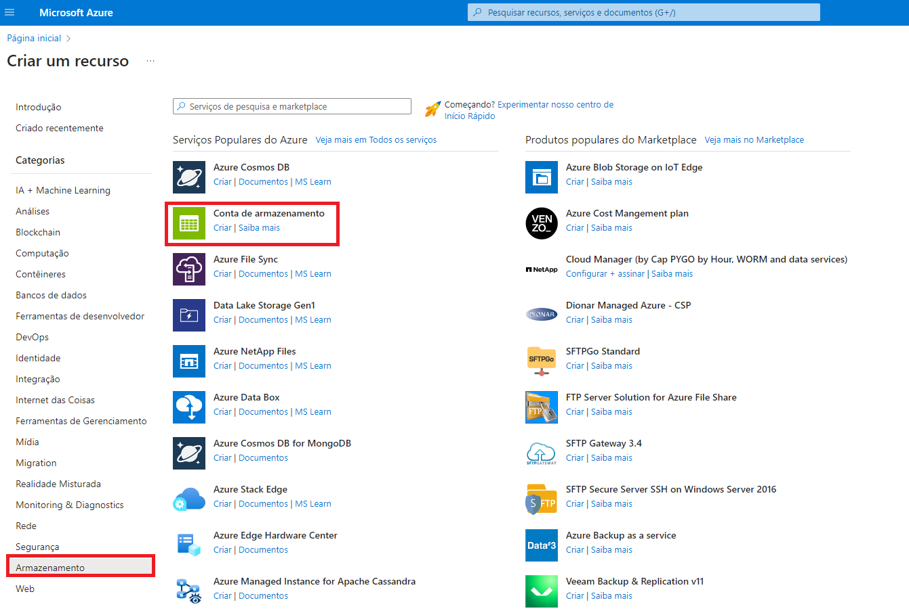
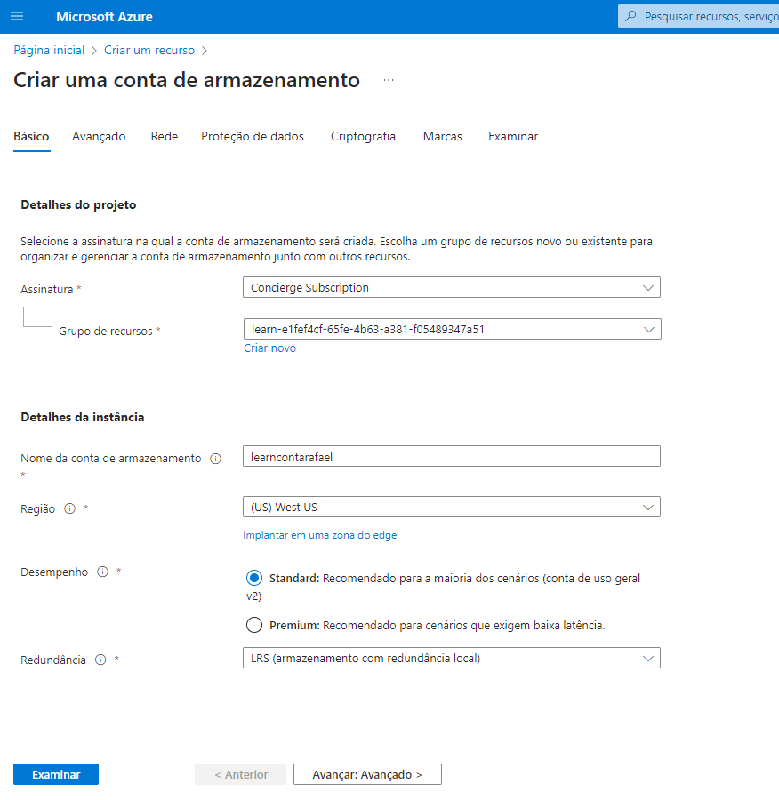
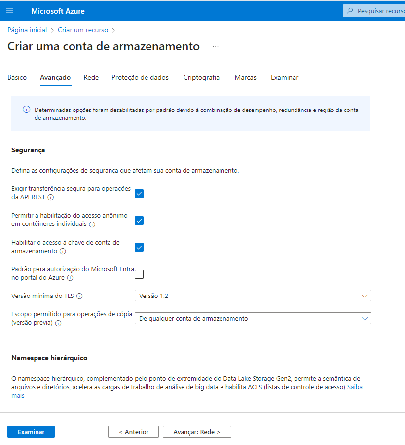
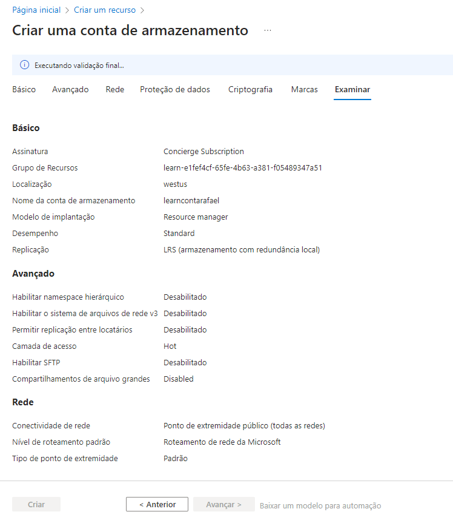
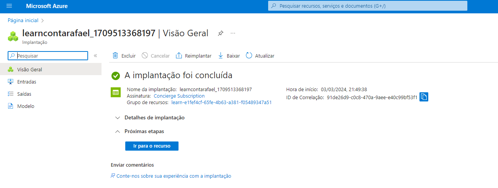
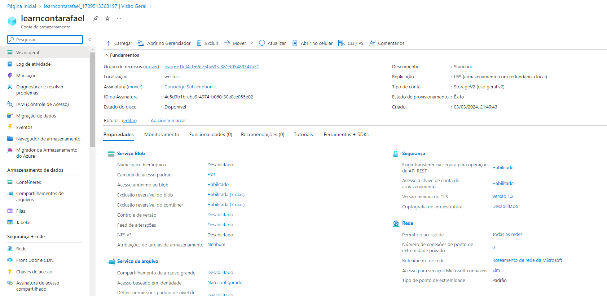
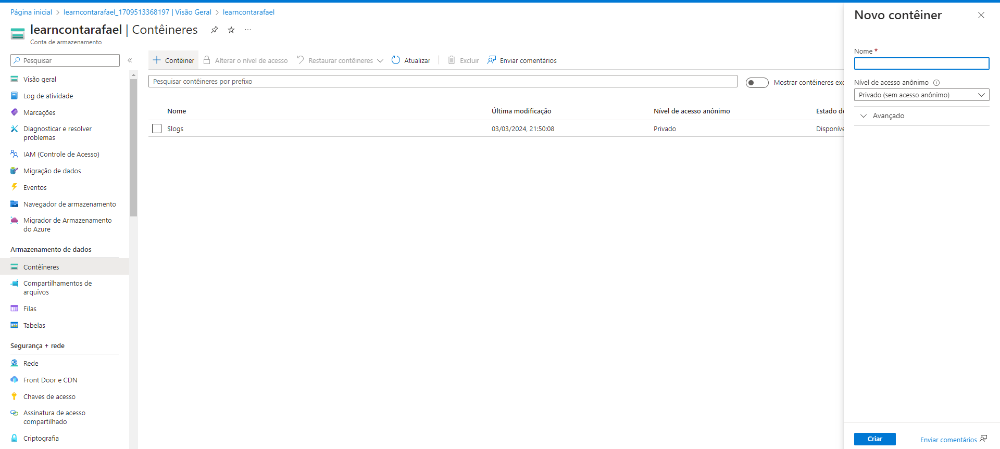
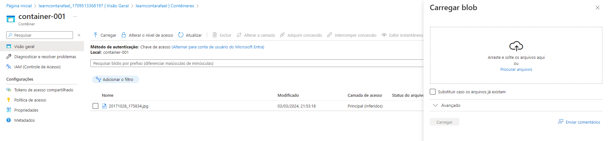
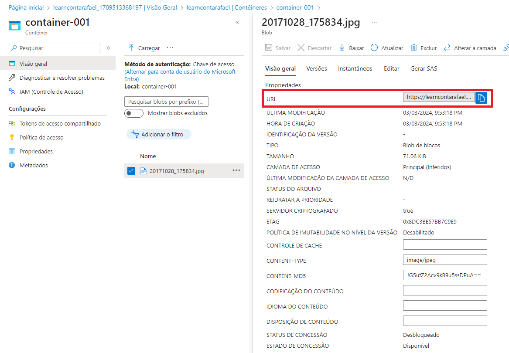
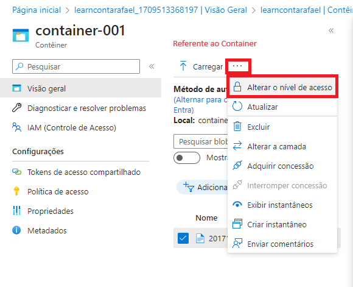
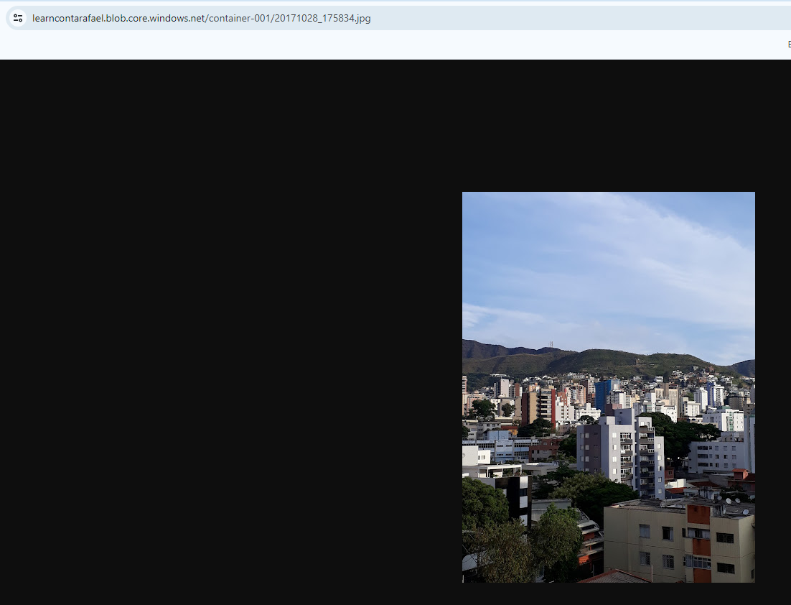


# Identificar as opções de migração de dados do Azure

Concluído100 XP

-   5 minutos

Agora que você entende as diferentes opções de armazenamento no Azure, é importante entender também como colocar seus dados e informações no Azure. O Azure dá suporte à migração em tempo real de infraestrutura, aplicativos e dados usando o serviço Migrações para Azure, bem como a migração assíncrona de dados usando o Azure Data Box.

## Migrações para Azure

O Migrações para Azure é um serviço que ajuda você a migrar de um ambiente local para a nuvem. O Migrações para Azure funciona como um hub para ajudar você a gerenciar a avaliação e a migração do datacenter local para o Azure. Elas fornecem o seguinte:

-   **Plataforma de migração unificada**: Um único portal para iniciar, executar e acompanhar sua migração para o Azure.
-   **Variedade de ferramentas**: Uma variedade de ferramentas para avaliação e migração. As ferramentas das Migrações para Azure incluem itens como Migrações para Azure: descoberta e avaliação. Além de Migrações para Azure: ferramenta de Migração do Servidor. As Migrações para Azure também integram-se a outros serviços do Azure e a outras ferramentas, bem como com ofertas de ISVs (fornecedores independentes de software).
-   **Avaliação e migração**: no hub do Migrações para Azure, você pode avaliar e migrar sua infraestrutura local para o Azure.

### Ferramentas integradas

Além de trabalhar com ferramentas de ISVs, o hub do Migrações para Azure também inclui as seguintes ferramentas para ajudar na migração:

-   **Migrações para Azure: Descoberta e avaliação**. Descubra e avalie servidores locais em execução em VMware, Hyper-V servidores físicos para se preparar para a migração para o Azure.
-   **Migrações para Azure: Migração de Servidor**. Migre VMs do VMware, VMs do Hyper-V, servidores físicos, outros servidores virtualizados e VMs da nuvem pública para o Azure.
-   **Assistente de Migração de Dados**. O Assistente de Migração de Dados é uma ferramenta autônoma criada para avaliar SQL Servers. Ele ajuda a identificar possíveis problemas que bloqueiam a migração. Ele identifica recursos sem suporte e novos recursos dos quais você pode se beneficiar após a migração e o caminho certo para a migração de banco de dados.
-   **Serviço de Migração de Banco de Dados do Azure**. Migre bancos de dados locais para VMs do Azure executando SQL Server, Banco de Dados SQL do Azure ou Instâncias Gerenciadas de SQL.
-   **Assistente de Migração do Serviço de Aplicativo do Azure**. O Assistente de Migração do Serviço de Aplicativo do Azure é uma ferramenta autônoma para avaliar sites locais para migração para o Serviço de Aplicativo do Azure. Use o Migration Assistant para migrar aplicativos Web .NET e PHP para o Azure.
-   **Azure Data Box**. Use os produtos Azure Data Box offline para mover grandes quantidades de dados offline para o Azure.

## Azure Data Box

O Azure Data Box é um serviço de migração física que ajuda a transferir grandes quantidades de dados de maneira rápida, barata e confiável. A transferência de dados segura é acelerada com o envio de um dispositivo de armazenamento Data Box proprietário que tem uma capacidade máxima de armazenamento utilizável de 80 terabytes. O Data Box é transportado entre o datacenter por meio de uma empresa regional. Uma caixa robusta protege o Data Box contra danos durante o transporte.

Você pode solicitar o dispositivo Data Box pelo portal do Azure para importar dados de ou exportar dados para o Azure. Depois que o dispositivo é recebido, você pode configurá-lo rapidamente usando a IU da Web local, e conectá-lo à sua rede. Depois de terminar a transferência dos dados (para dentro ou para fora do Azure), basta devolver o Data Box. Se você estiver transferindo dados para o Azure, eles serão carregados automaticamente depois que a Microsoft receber o Data Box de volta. Todo o processo é acompanhado de ponta a ponta pelo serviço Data Box no portal do Azure.

### Casos de uso

O Data Box é ideal para transferir os tamanhos de dados maiores do que 40 TB em cenários com conectividade de rede limitada a inexistente. A movimentação de dados pode ser única, periódica ou uma transferência de dados em massa inicial seguida por transferências periódicas.

Veja a seguir os vários cenários em que o Data Box pode ser usado para importar dados para o Azure.

-   Migração única – Quando um grande volume de dados do local é transferido para o Azure.
-   Movimentação de uma biblioteca de mídia de fitas offline para o Azure para a criação de uma biblioteca de mídia online.
-   Migração do farm de VMs, do SQL Server e de aplicativos para o Azure.
-   Migração de dados históricos para o Azure para análise e relatórios detalhados com o HDInsight.
-   Transferência em massa inicial – quando uma transferência em massa inicial é feita usando o Data Box (semente) seguida por transferências incrementais pela rede.
-   Carregamentos periódicos - quando grandes quantidades de dados são geradas periodicamente e precisam ser movidas para o Azure.

Veja a seguir os vários cenários em que o Data Box pode ser usado para exportar dados do Azure.

-   Recuperação de desastre – quando uma cópia dos dados do Azure é restaurada para uma rede local. Em um cenário típico de recuperação de desastre, um grande volume de dados do Azure é exportado para um Data Box. Em seguida, a Microsoft envia esse Data Box, e os dados são restaurados no seu local após um breve período.
-   Requisitos de segurança – quando você precisa ser capaz de exportar dados provenientes do Azure devido a requisitos governamentais ou de segurança.
-   Migre de volta para o local ou para outro provedor de serviços de nuvem: quando desejar mover todos os dados de volta para o local ou para outro provedor de serviços de nuvem, exporte os dados por meio do Data Box para migrar as cargas de trabalho.

Depois que os dados do seu pedido de importação são importados no Azure, os discos do dispositivo são apagados, de acordo com os padrões NIST 800-88r1. Para uma ordem de exportação, os discos são apagados quando o dispositivo atinge o datacenter do Azure.


# Identificar as opções de movimentação de arquivos do Azure

Concluído100 XP

-   3 minutos

Além da migração em larga escala usando serviços como Migrações para Azure e Azure Data Box, o Azure também tem ferramentas projetadas para ajudar você a mover ou interagir com arquivos individuais ou grupos de arquivos pequenos. Entre essas ferramentas estão AzCopy, Gerenciador de Armazenamento do Azure e Sincronização de Arquivos do Azure.

## AzCopy

O AzCopy é um utilitário de linha de comando que você pode usar para copiar blobs ou arquivos de/para uma conta de armazenamento. Com o AzCopy, você pode carregar arquivos, baixar arquivos, copiar arquivos entre contas de armazenamento e até mesmo sincronizar arquivos. O AzCopy pode até mesmo ser configurado para trabalhar com outros provedores de nuvem para ajudar a mover arquivos entre nuvens.

Importante

A sincronização de blobs ou arquivos com o AzCopy é uma sincronização de apenas uma direção. Ao sincronizar, você designa a origem e o destino e o AzCopy copiará arquivos ou blobs nessa direção. Ele não sincroniza bidirecionalmente com base em carimbos de data/hora ou outros metadados.

## Gerenciador de Armazenamento do Azure

O Gerenciador de Armazenamento do Azure é um aplicativo autônomo que fornece uma interface gráfica para gerenciar arquivos e blobs em sua Conta do Armazenamento do Azure. Ele funciona em sistemas operacionais Windows, macOS e Linux e usa o AzCopy no back-end para executar todas as tarefas de gerenciamento de arquivos e blobs. Com o Gerenciador de Armazenamento, você pode carregar no Azure, baixar do Azure ou mover entre contas de armazenamento.

## Sincronização de Arquivos do Azure

A Sincronização de Arquivos do Azure é uma ferramenta que permite centralizar seus compartilhamentos de arquivos no serviço Arquivos do Azure e manter a flexibilidade, o desempenho e a compatibilidade de um servidor de arquivos do Windows. É quase como transformar o servidor de arquivos do Windows em uma rede de distribuição de conteúdo em miniatura. Depois de instalar a Sincronização de Arquivos do Azure no seu servidor Windows local, ele permanecerá automaticamente sincronizado bidirecionalmente com seus arquivos no Azure.

Com a Sincronização de Arquivos do Azure, você pode:

-   Usar qualquer protocolo disponível no Windows Server para acessar seus dados localmente, incluindo SMB, NFS e FTPS.
-   Ter tantos caches quantos precisar em todo o mundo.
-   Substituir um servidor local com falha instalando a Sincronização de Arquivos do Azure em um novo servidor no mesmo datacenter.
-   Configurar a camada de nuvem para que os arquivos acessados com mais frequência sejam replicados localmente, enquanto os arquivos acessados com pouca frequência sejam mantidos na nuvem até que sejam solicitados.
-   

# Verificar seus conhecimentos

1. Qual ferramenta mantém automaticamente os arquivos atualizados entre um servidor Windows local e um ambiente de nuvem do Azure? 

Sincronização de Arquivos do Azure
A Sincronização de Arquivos do Azure mantém uma sincronização bidirecional de arquivos entre seus servidores Windows locais e na nuvem.


Gerenciador de Armazenamento do Azure

AzCopy
2. Qual opção de redundância de armazenamento fornece o maior grau de durabilidade, com 16 noves de durabilidade? 

Armazenamento com redundância local

Armazenamento com redundância de zona

Armazenamento com redundância geográfica
O GRS (armazenamento com redundância geográfica) e o GZRS (armazenamento com redundância de zona geográfica) fornecem 16 noves de durabilidade.

3. Qual serviço de Armazenamento do Azure dá suporte à análise de Big Data, bem como à manipulação de tipos de dados de texto e binários? 

Blobs do Azure
O Armazenamento de Blobs do Azure é um repositório de objetos altamente escalonável para texto e dados binários. Os Blobs do Azure incluem suporte para análise de Big Data por meio do Data Lake Storage Gen2.


Arquivos do Azure

Discos do Azure


## Objetivos de aprendizagem

Agora você deve estar apto a:

-   Comparar os serviços de armazenamento do Azure.
-   Descrever as camadas de armazenamento.
-   Descrever as opções de redundância.
-   Descrever as opções de conta de armazenamento e os tipos de armazenamento.
-   Identificar opções para mover arquivos, incluindo o AzCopy, o Gerenciador de Armazenamento do Azure e a Sincronização de Arquivos do Azure.
-   Descrever as opções de migração, incluindo as Migrações para Azure e o Azure Data Box.

## Recursos adicionais

Os recursos a seguir oferecem mais informações sobre os tópicos neste módulo ou relacionados a ele.

-   [Armazenar dados no Azure](https://learn.microsoft.com/pt-br/learn/paths/store-data-in-azure/)  é um curso do Microsoft Learn que aborda mais informações sobre o armazenamento de dados no Azure.
-   [Microsoft Certified: Azure Data Fundamentals](https://learn.microsoft.com/pt-br/learn/certifications/azure-data-fundamentals/)  é uma certificação completa, com o treinamento associado que se aprofunda nos conceitos básicos de dados no Azure.